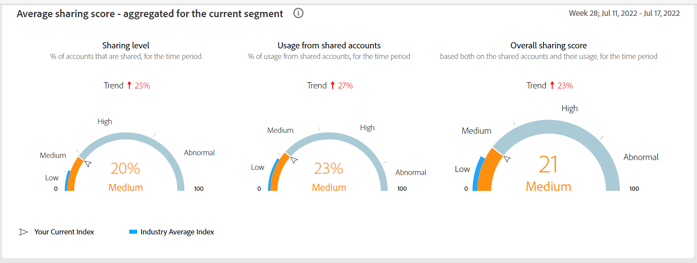
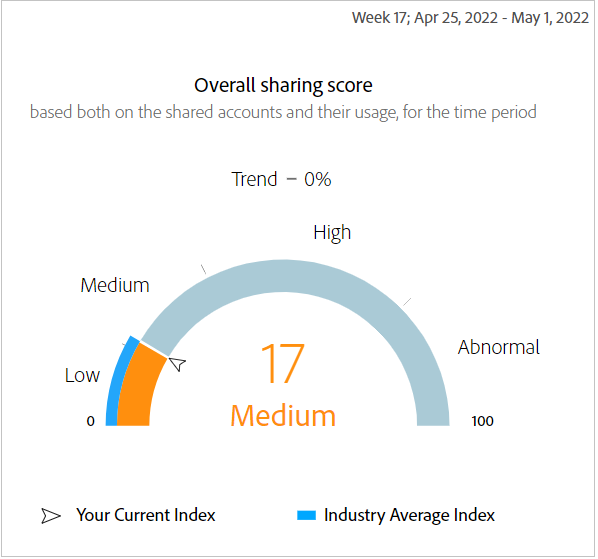

# Le tableau de bord {#dashboard}

Le tableau de bord résume et agrège les données dans une collection de graphiques et de rapports, conçue pour donner un aperçu général de la portée et de l’impact du partage de compte. Il fournit une page unique contenant les principaux rapports et mesures du compte IQ.

*Figure : Le tableau de bord*

## Score de partage moyen - agrégé pour le segment actuel {#aggregated-sharing}

Le panneau Score de partage agrégé fournit un résumé de première ligne résumant la quantité et l’impact du partage en termes de comptes et de volume de diffusion.

Les valeurs vous aident à comprendre l’ampleur du partage des informations d’identification par vos abonnés, ce qui vous permet de mesurer la nécessité d’agir sur celle-ci.

*Figure : Panneau Note de partage moyenne - agrégé pour le segment actuel*

Les trois mesures suivantes sont des composants de la note de partage moyenne.

### Niveau de partage {#sharing-level}

La jauge du niveau de partage indique le pourcentage de tous vos comptes d’abonnés (dans le segment défini) qui sont partagés, pendant la période sélectionnée.

Une valeur calculée à partir d’une moyenne de la probabilité de partage calculée pour chaque compte dans l’ensemble des distributeurs multicanaux sélectionnés qui a diffusé en continu depuis l’un des canaux de programmeurs sélectionnés pendant la période sélectionnée.

*Figure : Niveau de partage*

L’indicateur de tendance affiche le pourcentage de changement de la valeur de la mesure dans par rapport à la période précédente.

### Utilisation de comptes partagés {#usage-from-shared-accounts}

Cette jauge indique le pourcentage d’utilisation de tous les comptes d’abonnés provenant des comptes partagés pour le segment défini et la période. La jauge marque les plages d’utilisation (des comptes partagés) sur l’échelle de 0 à 100 %. Ces plages (nommées Faible, Moyen, Élevé et Abnormal) sont basées sur la moyenne du secteur.

Vous pouvez également voir l’indicateur de tendance, qui illustre une augmentation ou une baisse de l’utilisation des comptes partagés par rapport à la période précédente.

*Figure : Utilisation de comptes partagés*

### Score de partage global {#overall-sharing-score}

Le score de partage global est un composite des scores de partage, y compris &quot;Niveau de partage&quot; et &quot;Utilisation z des comptes partagés&quot;.

Il fournit une valeur destinée à refléter l’impact relatif du partage par rapport à l’industrie. Son objectif est similaire à celui d’un score de crédit, résumant la situation par un seul chiffre. Mais dans ce cas, plus le nombre est élevé, plus le danger potentiel est grand.

*Figure : Score de partage global*

<!--### MVPDs in segment {#mvpd-in-segment}

It is a table of risk indices and accounts totals for the top MVPDs ranked by overall usage or account sharing.

-->

### Scores de partage globaux à l’échelle du secteur pour les distributeurs multicanaux de programmes audiovisuels {#top-mvpds}

Ce tableau fournit une vue comparative des différents scores de partage agrégés pour les MVPD dans le segment.

>[!NOTE]
>
>Ce tableau utilise les données globales de l’industrie à des fins de comparaison, et non les données représentées par ces distributeurs multicanaux dans le segment.

*Figure : Meilleurs MVPD dans le segment par score global*

### Score de partage par canaux et MVPD {#sharin-score-by-channels-and-mvpds}

Ce tableau fournit une vue comparative du partage des scores des canaux sélectionnés pour les MVPD dans le segment actuel.

*Figure : Partage de scores par canaux et MVPD*

### Probabilité de partage des comptes {#accounts-sharing-probability}

Ce graphique partitionne les comptes en plages de quintiles de probabilité de partage allant de très bas (0-20 %) à très élevés (80=100 %).

>[!NOTE]
>
>Le graphique à barres utilise une échelle logarithmique.

*Figure : Nombres et pourcentages de comptes abonnés dans différentes plages de probabilités de partage*

### Nombre de comptes et d’utilisations en partageant le niveau de probabilité {#number-of-accounts-usage-sharing-probability}

Ce panneau fournit une vue tabulaire des comptes partitionnés en plages de quintiles de probabilité de partage allant de très bas (0 à 20 %) à très élevé (80 à 100 %) avec l’utilisation associée de chaque quintile à partir de comptes partagés.

*Figure : Nombre de comptes, de tendances et d’utilisations appartenant à différentes périodes de probabilité*

