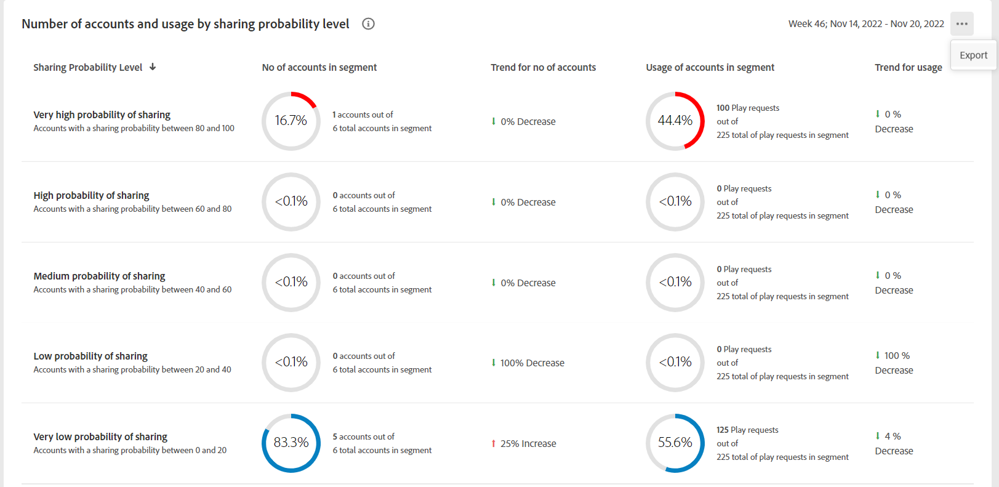

# Exportation de mesures pour les MVPD et les canaux dans un segment {#export-metric}

Le tableau de bord du compte IQ affiche des tableaux et des graphiques pour les statistiques de partage des informations d’identification des comptes abonnés du segment sélectionné. Outre l’affichage des schémas de partage et des scores, vous pouvez exporter les mesures d’utilisation du compte et partager les scores pour les abonnés des MVPD et des canaux dans le segment sélectionné à partir de ces tableaux.

Pour exporter des mesures pour les MVPD et les canaux dans un segment sélectionné, une fois connecté en tant qu’utilisateur programmeur autorisé :

1. Définissez un segment de votre choix en suivant les étapes de la section [Comment définir un segment et sélectionner une période](/help/AccountIQ/howto-select-segment-timeframe.md) pour l’évaluation à partir de [segment et période](/help/AccountIQ/segments-timeframe.md) du panneau.

1. Accédez à l’un des panneaux suivants :

   * Scores de partage au niveau du secteur pour les MVPD sélectionnés
      

   * Score de partage par canaux et MVPD dans le segment

      

   * Nombre de comptes et d’utilisations en partageant le niveau de probabilité

      

1. Sélectionner **Exporter** dans le coin supérieur droit du panneau.

Les données sont exportées au format CSV et le fichier est téléchargé localement sur votre appareil. Vous pouvez utiliser la visionneuse CSV et l’éditeur de votre choix pour ouvrir les rapports exportés.

* Scores de partage au niveau du secteur pour les MVPD sélectionnés

   

* Score de partage par canaux et MVPD dans le segment

   

* Nombre de comptes et d’utilisations en partageant le niveau de probabilité

   

