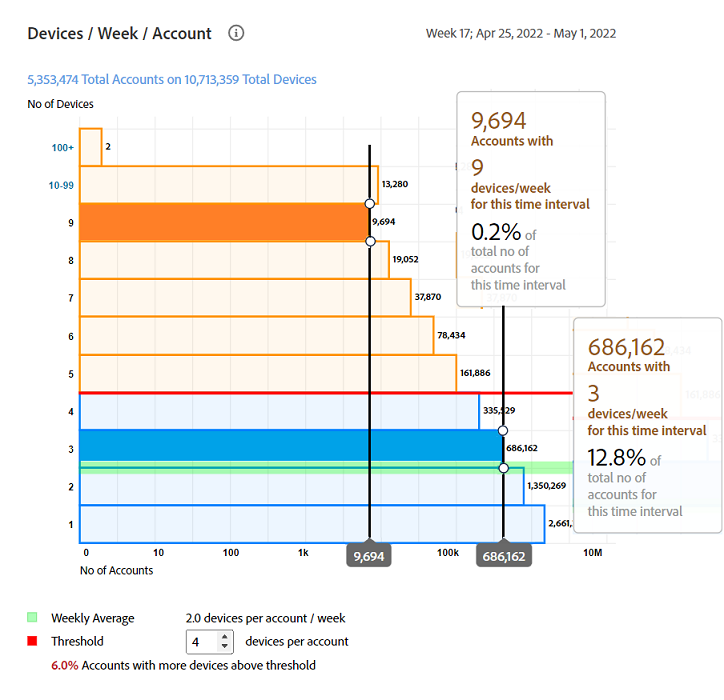
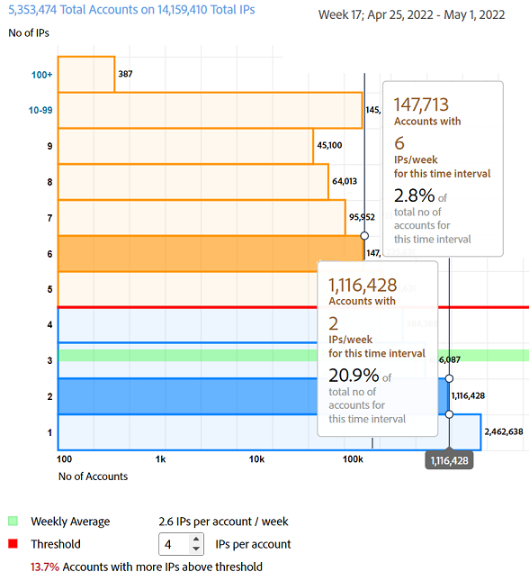

# Rapports d’utilisation générale {#general-usage-reports}

Les rapports de l’IQ du compte sont des outils d’analyse et des rapports de base qui vous permettent d’explorer vos données pour les isoler. [cohortes](/help/AccountIQ/product-concepts.md#segmet-def), identifiez les anomalies et apportez-vous une compréhension des caractéristiques de votre compte.

La page des rapports d’utilisation générale fournit des outils permettant de créer des sous-groupes de mesures en fonction du nombre de périphériques de compte utilisés, des adresses IP détectées et des codes postaux respectifs.

<!--Divide the content in cohorts.

Content filters
device filters

segment and definition replicate to cohorts. Number of people and number of account that ......
content consumption.....-->

Les rapports reposent tous sur le segment actuel sélectionné à l’aide de la variable [Segments et période](/help/AccountIQ/howto-select-segment-timeframe.md) du panneau. Vous pouvez affiner votre sélection et la réduire davantage en spécifiant les seuils (nombre d’appareils, nombre d’adresses IP et nombre de codes postaux) dans [Aperçu des instantanés - Comptes au-dessus des seuils](#snapshot-overview) du panneau.

<!--To view General Usage Reports:

1. Select the desired MVPDs from the **MVPDs in Segment** option.

2. Select the desired programmer channels from the **Channels in Segment** Option.

3. Select an appropriate time frame from the **Granularity and time frame** option.

   Using the above options you have defined segments for your analysis. Based on your segment selection, following graphs and reports are displayed.

4. You can fine tune your selection and further narrow it down by specifying (number of devices, number of IPs, and number of zip codes) thresholds in [Snapshot Overview - Accounts above thresholds](#snapshot-overview) widget/panel.-->

## AuthN OK / AuthZ OK / Lire les requêtes / Abonnés uniques {#authn-authz-playreq-uniquesubs}

Les graphiques linéaires présentent ici les changements au fil du temps dans les valeurs AuthN OK, AuthZ OK, Lire les requêtes et Abonnés uniques au cours d’une période sélectionnée pour le segment défini.

L’axe X présente les unités au cours de la période actuelle et l’axe Y représente les mesures de base de l’activité des abonnés au cours de cette période. Les graphiques linéaires vous permettent de comparer les valeurs suivantes pour les abonnés des distributeurs multicanaux et les canaux que vous avez sélectionnés dans le panneau de sélection de segments :

* **AuthN OK**

   AuthN OK est le nombre d’authentifications réussies. Pour plus d’informations et de définition, voir [Concepts du produit : AuthN OK](/help/AccountIQ/product-concepts.md#authn-ok-def).

* **AuthZ OK**

   AuthZ OK est le nombre d’autorisations réussies. Pour plus d’informations et de définition, voir [Concepts du produit : AuthZ OK](/help/AccountIQ/product-concepts.md#authz-ok-def).

* **Lire les requêtes**

   Les requêtes de lecture correspondent au nombre de requêtes de lecture. Pour plus d’informations et de définition, voir [Concepts du produit : Lecture des requêtes](/help/AccountIQ/product-concepts.md#play-requests-def)

* **Abonnés uniques**

   Les abonnés uniques sont le nombre d’abonnés uniques réussis. Pour plus d’informations et de définition, voir [Concepts du produit : Abonnés uniques](/help/AccountIQ/product-concepts.md#unique-subscriber-def)

   >[!NOTE]
   >
   >Le nombre total d’abonnés uniques inclut également le nombre de périphériques uniques si l’utilisation par un programmeur de TempPass (aperçu gratuit) d’un Adobe fait partie du segment.

## Aperçu des instantanés - Comptes au-dessus des seuils {#snapshot-overview}

Affinez vos analyses et rapports à l’aide de ce filtre supplémentaire afin de définir différents seuils d’utilisation. Une fois que vous avez défini votre segment (ou cohorte) pour analyse en sélectionnant le(s) MVPD(s) et les canaux souhaités, vous pouvez également utiliser les filtres suivants pour analyser le comportement des abonnés :

* Nombre seuil de périphériques

* Nombre seuil d’adresses IP

* Nombre seuil de codes postaux

Lorsque vous mettez à jour les valeurs de seuil dans [Segment de comptes - en fonction des seuils sélectionnés](#account-segments-basedon-segments) vous pouvez afficher l’effet dans :

* [Périphériques par semaine (ou mois), par compte](#devices-week-account)

* [Emplacements par semaine (ou mois) par compte](#locations-week-account)

* [IP par semaine (ou mois) par compte](#ip-week-account)

* [Vue historique du segment des comptes](#account-segment-historical-view)

>[!NOTE]
>
>La valeur par défaut de chacun des seuils est 4. En d’autres termes, la page Utilisation générale affiche l’analyse des MVPD avec abonnés utilisant quatre (et plus de quatre) appareils, consommant du contenu provenant de quatre (et plus) emplacements géographiques différents et quatre (et plus) codes postaux différents.

### Segment de comptes - en fonction des seuils sélectionnés {#account-segments-basedon-segments}

Le **Segment de comptes - en fonction des seuils sélectionnés** vous donne la possibilité de définir des seuils (entre 1 et 10) pour le nombre d’appareils, le nombre d’adresses IP et le nombre de codes postaux.

Le graphique vous montre les éléments suivants :

* nombre absolu de comptes d’abonnés, et

* pourcentage sur le total des comptes abonnés de ce segment,

   qui utilisent X nombre d’appareils, Y nombre d’adresses IP et Z nombre de codes postaux pour consommer du contenu de votre canal pour les MVPD (segment défini de), pendant une période.

## Périphériques par semaine (ou mois) par compte {#devices-week-account}

Le **graphique en barres** fournit des informations sur le comportement d’utilisation en ce qui concerne la manière dont les abonnés de vos distributeurs multicanaux utilisent leurs appareils pour accéder au contenu de votre canal.

L’axe X trace le nombre de comptes et l’axe Y trace le nombre de périphériques. En fonction du seuil que vous définissez pour le nombre d’appareils par compte, il marque le nombre absolu de comptes abonnés qui consomment du contenu d’un nombre spécifique d’appareils au cours d’une semaine.

Lorsque vous passez le curseur de la souris sur une barre (spécifique au nombre d’appareils), un libellé s’affiche, indiquant le nombre d’abonnés (et le pourcentage du nombre total de comptes d’abonnés dans le segment) qui diffusent du contenu de canal en continu à l’aide de ces nombreux appareils au cours d’une semaine.

Le graphique marque également les points suivants :

* Une ligne rouge pour marquer le seuil que vous définissez.

* Une ligne verte permettant de marquer la moyenne des différents appareils utilisés par un compte abonné par semaine (ou par mois).

Vous pouvez comparer le niveau de seuil avec la moyenne hebdomadaire du nombre de différents appareils utilisés par un compte, afin d’évaluer le niveau de partage.

Le graphique donne également un aperçu du pourcentage des comptes abonnés qui utilisent plus de périphériques que le seuil défini.

Le graphique en anneau vous aide à évaluer, d’un seul coup d’oeil, l’ampleur des comptes d’abonnés qui consomment du contenu de canal à l’aide d’appareils plus que le seuil défini (dans un délai).

## Emplacements par semaine (ou mois) par compte {#locations-week-account}

Comme [Périphériques par semaine (ou mois) par compte](#devices-week-account), la mesure Emplacements par semaine (ou mois) et par compte vous aide à analyser l’utilisation du compte d’abonné à partir de différents emplacements afin d’identifier plus précisément le partage de mot de passe. L’axe X trace le nombre de comptes et l’axe Y trace le nombre d’emplacements.

Résultats de cette mesure combinés au nombre [Périphériques par semaine (ou mois) par compte](#devices-week-account) et nombre de [IP par semaine (ou mois) par compte](#ip-week-account) vous aider à juger plus précisément les instances de partage de mot de passe ; afin que les utilisateurs authentiques ne soient pas comptabilisés.

Une fois que vous avez défini un segment (en sélectionnant des MVPD et des canaux) et défini le seuil de nombre d’emplacements, vous pouvez l’identifier à partir du graphique :

* Nombre (et pourcentage) d’abonnés qui consomment du contenu à partir (d’un emplacement spécifique) x nombre d’emplacements au cours d’une semaine.

* Pourcentage du nombre total de comptes d’abonnés qui visualisent du contenu à partir de plus d’emplacements que le seuil.

* Comparez la moyenne hebdomadaire (nombre d’emplacements différents pour un compte) au seuil.

## IP par semaine (ou mois) par compte {#ip-week-account}

Similaire à [Périphériques par semaine (ou mois) par compte](#devices-week-account) et [Emplacements par semaine (ou mois) par compte](#locations-week-account), la variable **Nombre d’adresses IP par semaine et par compte** vous permet d’analyser plus précisément et avec plus de granularité le partage des mots de passe.

L’axe X trace le nombre de comptes et l’axe Y trace le nombre d’adresses IP.

Une fois que vous avez défini un segment (en sélectionnant les MVPD et les canaux) et défini le seuil du nombre d’adresses IP, vous pouvez l’identifier à partir du graphique :

* Nombre (et pourcentage) d’abonnés qui consomment du contenu depuis (un nombre spécifique) x nombre d’adresses IP dans une semaine.

* Pourcentage du nombre total de comptes d’abonnés qui visualisent le contenu à partir d’un plus grand nombre d’adresses IP que le seuil.

* Comparez la moyenne hebdomadaire (nombre d’adresses IP différentes pour un compte) avec le seuil.

## Segment de comptes - Vue Historique {#account-segment-historical-view}

Le graphique à barres Aperçu historique vous permet de comparer les mesures d’utilisation sur différentes périodes. Il répertorie également collectivement les différentes mesures d’utilisation, telles que [Périphériques par semaine (ou mois) par compte](#devices-week-account), [Emplacements par semaine (ou mois) par compte](#locations-week-account), et [IP par semaine (ou mois) par compte](#ip-week-account).

* L’axe X trace la période et l’axe Y trace le nombre de comptes d’abonnés, de périphériques, d’emplacements et d’adresses IP.

* Les barres de couleur orange représentent des segments dans différentes périodes.

* Le graphique linéaire trace les modifications dans [Périphériques par semaine (ou mois) par compte](#devices-week-account), [Emplacements par semaine (ou mois) par compte](#locations-week-account), et [IP par semaine (ou mois) par compte](#ip-week-account) sur toute la période en fonction du seuil.

* Les barres bleues représentent le nombre total d’abonnés principaux dans l’ensemble du secteur pendant une période.

* Vous pouvez sélectionner des légendes spécifiques qui vous aideront à mettre le graphique à l’échelle.

>[!MORELIKETHIS]
>
>* Découvrez comment exporter des rapports pour les 1 000 premiers abonnés des MVPD sélectionnés à l’aide de filtres dans le rapport d’utilisation générale à l’aide des [Exporter les 1 000 premiers comptes](/help/AccountIQ/export-acc-information.md) .

