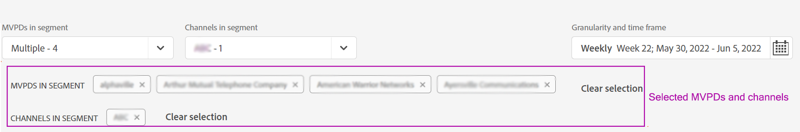
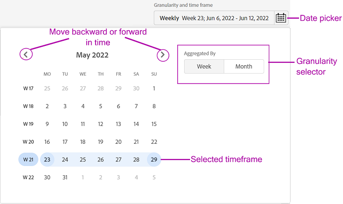

# Définition d’un segment et d’une période {#define-segment}

Tous les rapports d’analyse ou d’affichage dans le compte IQ commencent par définir un segment et sélectionner une période d’évaluation. [Segment](/help/AccountIQ/product-concepts.md#segmet-def) fait référence à tous les abonnés ou visiteurs qui répondent à vos critères d’évaluation (abonnement à un programme multivarié et affichage de canaux spécifiques).

*Figure : Sélection de segments et de périodes*

Dans la partie supérieure de toutes les pages de rapports du compte IQ, il existe un panneau pour définir un segment en sélectionnant les distributeurs multicanaux de programmes, les programmeurs de canaux, la granularité et la période.

## Sélection de segment {#select-segment}

### Sélectionner les MVPD dans le segment {#select-segment-mvpds}

Pour sélectionner des MVPD depuis **MVPD dans le segment** option :

1. Cliquez ou appuyez sur **MVPD dans le segment** de la liste déroulante.

   >[!NOTE]
   >
   >**Tous** les MVPD de secteur sont sélectionnés par défaut. À partir de là, vous pouvez sélectionner l’une des options suivantes : **Les 10 meilleurs MVPD en partageant le score**, **Les 10 principaux distributeurs multicanaux de programmes audiovisuels par utilisation**, **Les 10 principaux distributeurs multicanaux de programmes audiovisuels par compte** ou MVPD individuels. Toutefois, pour sélectionner des MVPD individuels, vous devez les désélectionner. **Tous**.

1. Cliquez ou appuyez sur les MVPD souhaités.

   Vous pouvez supprimer un MVPD de la sélection en le désélectionnant.

1. Cliquez ou appuyez sur **Appliquer la sélection** pour que votre sélection prenne effet. Sinon, vous perdrez la sélection que vous avez effectuée.

   >[!NOTE]
   >
   >Si vous sélectionnez le mode Isolation, aucun autre MVPD ne peut être sélectionné.

### Sélection de canaux dans un segment {#select-segment-channels}

Pour sélectionner les canaux de programmeur de votre choix, procédez comme suit : **Canaux dans le segment** option :

1. Cliquez ou appuyez sur **Canaux dans le segment** de la liste déroulante.

   >[!NOTE]
   >
   >**Tous** les canaux de programmation de votre entreprise sont sélectionnés par défaut. Pour sélectionner des canaux ou des programmeurs individuels, vous devez d’abord les désélectionner. **Tous**.

1. Cliquez ou appuyez sur les canaux ou les programmeurs de votre choix.

   Les éléments de liste de niveau supérieur dans la variable **Canaux dans le segment** are [programmeur](/help/AccountIQ/product-concepts.md#programmer-def) les sociétés et les éléments de liste sous les noms de programmeur sont leurs [channels](/help/AccountIQ/product-concepts.md#channel-def). Vous pouvez sélectionner des canaux individuels sous des programmeurs ou sélectionner des programmeurs et toutes les activités des canaux sous ce programmeur sont incluses dans les résultats des rapports et graphiques.

   <!--
   *Figure: Programmers and channels listed in channels selector*-->

   >[!IMPORTANT]
   >
   >Les résultats de la sélection de canaux individuels sous un programmeur ne sont pas identiques à ceux de la sélection du programmeur.
   >
   >
   >Lorsque vous sélectionnez des canaux individuels, les activités de ces canaux sont ventilées individuellement dans certains rapports. Cependant, lorsque vous sélectionnez le programmeur parent de tous ces canaux, toutes les activités de ces canaux sont incluses, mais ne sont pas ventilées individuellement dans les rapports.

1. Cliquez ou appuyez sur **Appliquer la sélection** pour que votre sélection prenne effet.

>[!NOTE]
>
>Vous ne pouvez pas sélectionner plus de 10 éléments dans les menus déroulants du MVPD ou du programmeur.

### Désélectionner les MVPD et les canaux {#deselect-segment-mvpds-channels}

En plus de modifier votre sélection dans la variable **MVPD dans le segment** et **Canaux dans le segment** sélecteurs de segments, vous pouvez désélectionner les MVPD et canaux sélectionnés précédemment en procédant comme suit :

* En sélectionnant le **Supprimer** Icône () sur les noms de ces MVPD et canaux sélectionnés affichés sous le sélecteur de segments.

* Vous pouvez également utiliser **Effacer la sélection** pour supprimer tous les MVPD ou canaux sélectionnés précédemment.

*Figure : MVPD et canaux sélectionnés dans le panneau de segments et de périodes*

*Figure : MVPD et canaux sélectionnés dans le panneau de segments et de périodes*

## Granularité et sélection de période {#granularity-timeframe}

Pour sélectionner une période d’évaluation :

1. Sélectionnez la **Granularité et période** Sélecteur de date.

1. Sélectionnez **Semaine** ou **Mois** de **Agréger par** pour définir la granularité de votre évaluation.

   <!--   *Figure: Date picker to select Granularity and time frame*-->

1. Une fois la granularité sélectionnée, vous pouvez utiliser les flèches vers l’avant ou vers l’arrière pour avancer ou reculer dans le temps.

1. Spécifiez une période dans le passé (en mois ou en semaine selon la granularité sélectionnée) pour l’évaluation.

1. Sélectionner **Appliquer la sélection** pour vous assurer que votre sélection prend effet.
