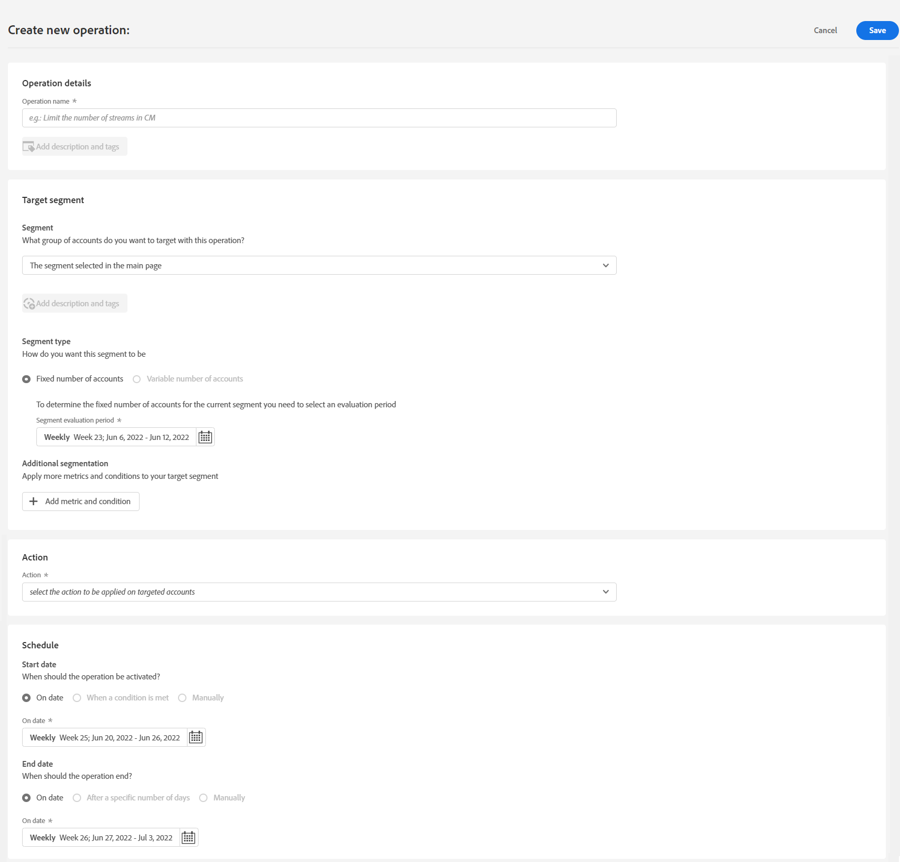
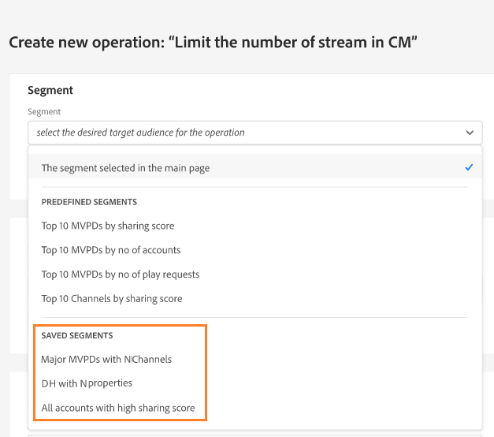

# Création d’une opération sur un segment d’utilisateur {#operation-to-track-segment}

Chaque page de rapports sur le compte IQ comporte une **Créer une opération** l’option permettant de créer des workflows afin d’automatiser (et de simplifier) diverses actions (en bloc) sur les comptes d’abonnés ; définir des règles pour spécifier un exemple, définir des actions, enregistrer et analyser les effets de ces actions ; Sur la page de création des opérations, vous pouvez définir l’exemple de groupes d’utilisateurs sur lequel les opérations seront effectuées et planifier l’exécution de l’opération à une date ultérieure.

Pour créer une opération :

1. Définissez votre segment (cohorte) à des fins d’analyse sur l’une des pages de rapports ou de tableaux de bord, en suivant les étapes de la section [Définition des segments et période](/help/AccountIQ/howto-select-segment-timeframe.md).

1. Sélectionner **Créer une opération** option disponible sur l’une des pages de rapports ou de tableaux de bord. Le **Créer une opération** s’affiche.

   
   *Figure : Page pour créer une opération*

1. Sur le **Créer une opération** , renseignez les détails dans les champs de formulaire pour :

   * [Nom de l’opération](#operation-details) dans les détails de l’opération
   * Segment sur lequel exécuter l’opération [Segment cible](#segment) et affiner le segment à l’aide de [Segmentation supplémentaire](#additional-segmentation)
   * [Type de segment](#segment-type) under [Segment cible](#segment)
   * [Action](#action)
   * [Planification de l’activation](#schedule)

1. [Enregistrer l’opération](#save-operation).

## Détails de l&#39;opération {#operation-details}

+++Détails de l’opération Programmer

Nommez la nouvelle opération dans **Nom de l’opération** sous Détails de l’opération. Par exemple, &quot;*Testez l’effet de l’authentification multifactorielle sur les abonnés de MVPD X&quot; ou &quot;Limitez le nombre de diffusions dans la surveillance simultanée&quot; ou &quot;Limitez les abonnés de MVPD D qui visualisent le canal &quot;N&quot; à partir de plus de 20 appareils.*&quot;.

+++

+++MVPD - détails de l’opération

Nommez la nouvelle opération dans **Nom de l’opération** sous Détails de l’opération. Par exemple, &quot;*Testez l’effet de l’authentification multifactorielle sur les visionneuses du canal N ou &quot;Limitez le nombre de diffusions dans la surveillance simultanée&quot; ou &quot;Limitez les abonnés qui visualisent le canal N à partir de plus de 20 appareils.*&quot;.

+++

## Segment cible {#segment}

+++Programmeur - Segment Target

Le **Segment** définit ici les utilisateurs qui seront exploités par cette opération ; ou le groupe d’exemple de votre opération. Le segment par défaut est le suivant : **segment** vous avez sélectionné à l’aide de [panneau de segments et de périodes](/help/AccountIQ/howto-select-segment-timeframe.md) sur la page principale des rapports ou des tableaux de bord à l’étape 1 ci-dessus.

<!--* The first segment entry in the **Segment** section, by default, shows the **segment** you selected in the step 1.

* The **segment evaluation period** is the time period of analysis you selected in step 1 from **Granularity and Timeframe** option.

*Figure: Segment and timeframe selection on the main page*-->

Ce segment définit les abonnés qui seront affectés par l’opération en cours de création. Par exemple, le segment sélectionné peut spécifier *tous les comptes abonnés du MVPD nommés &quot;C&quot; qui affichent le canal &quot;N Sports&quot;*.

+++

+++MVPD - Segment cible

Le **Segment** définit ici les utilisateurs qui seront exploités par cette opération ; ou le groupe d’exemple de votre opération. Le segment par défaut est le suivant : **segment** vous avez sélectionné à l’aide de [panneau de segments et de périodes](/help/AccountIQ/howto-select-segment-timeframe.md) sur la page principale des rapports ou des tableaux de bord à l’étape 1 ci-dessus.

<!--* The first segment entry in the **Segment** section, by default, shows the **segment** you selected in the step 1.

* The **segment evaluation period** is the time period of analysis you selected in step 1 from **Granularity and Timeframe** option.

*Figure: Segment and timeframe selection on the main page*-->

Ce segment définit vos abonnés (qui sont des visionneuses de canaux spécifiques) qui seront affectés par l’opération en cours de création. Par exemple, votre segment (par défaut) comprend *tous les comptes abonnés qui affichent le canal &quot;N Sports&quot;*.
+++

### Segmentation supplémentaire {#additional-segmentation}

De plus, vous pouvez affiner votre segment cible en ajoutant d’autres mesures. Par exemple, vous pouvez ajouter une probabilité de partage supérieure à 90 % comme autre mesure. Donc, maintenant l&#39;énoncé du problème dit : *&quot;créer une opération pour les comptes abonnés du MVPD nommés &quot;C&quot; qui visionnent le canal &quot;N Sports&quot; avec une probabilité de partage supérieure à 90 %&quot;*.

*Figure : Segmentation supplémentaire*

De plus, si vous affinez l’opération en ajoutant une autre mesure pour le nombre d’appareils, l’instruction de problème mise à jour se lit comme suit : *&quot;créer une opération pour les comptes abonnés du MVPD nommés &quot;C&quot; qui consultent le canal &quot;N Sports&quot; dont le score de partage est supérieur à 90 et qui utilisent plus de 5 appareils pour afficher le contenu pendant la période d’évaluation.&quot;*.

*Figure : Amélioration du segment d’exemples avec le score de partage global et les mesures du nombre d’appareils*

Ce faisant, le groupe d’utilisateurs devient plus affiné. Ainsi, en ajoutant d’autres mesures et conditions, vous qualifiez davantage le segment pour définir les comptes sur lesquels il doit fonctionner.

### Type de segment {#segment-type}

Le type de segment est la manière dont un segment est traité tout au long de la période d’évaluation de l’opération.

*Figure : Affiner le nombre de segments à utiliser à l’aide du type Segment*

<!--The segment type option allows you to further refine your segment based on the evaluation period (or time).

**Fixed number of accounts** 

When you select **Fixed number of accounts** segment type, then you need to specify an evaluation period as well.

By doing so, you are fixing the sample size for evaluation in terms of numbers. You are making Account IQ identify a specific set of users (that meet the criteria of defined evaluation period and segment metrics) to operate on. The analysis and graphs will be generated for this specific set of users only (identified initially) throughout the operation.

**Variable number of accounts**

When you select **Variable number of accounts** segment type, you do not limit the number of accounts in segment. The accounts which fall under the defined segment metrics are the part of the segment, and the number of accounts will change continuously during the course of operation.-->

>[!IMPORTANT]
>
>Vous pouvez uniquement utiliser **Nombre fixe de comptes** , à partir de maintenant. L’option à sélectionner **Nombre variable de comptes** seront disponibles dans les prochaines versions.

<!--

you tell Account IQ in the beginning of the operation which number of accounts to operate on.

Account IQ system only has a segment definition, and during the operation it looks into all the accounts that fit that segments.

the number of accounts in segment is not limited, the accounts that fall under defined segment metrics will be part of the segment, and the no of accounts will change continuously, as there are no specific limitations - like an evaluation period in the past.When the segment is defined (which in this example is, subscriber accounts of MVPD 'C' who are viewing the channel 'N Sports' that have a sharing score above 80 and are using 10 different IPs) and we also identified a time period to evaluate a segment. This identifies X number of accounts as sample (for example 5000). How many devices they are using?
It identifies x-number of accounts (5000)...a very specific set of users that meet this criteria.
for every period that we schedule (within that operation) during that operation) we will look at those 5K users that are originally identified and we will present graph about them. How are the sharing scores coming up?u We identified a period. Are their sharing scores going up? Are there fewer of them who are meeting this definition?
Fixed versus variable is the way the treated in fixed or variable way.

1. we identified a fixed set of accounts.
2. we evaluate those specific accounts on criteria throughout the operation.

General idea independent of graph is that we will evaluate a set of accounts identified initially, for no of periods during operation and generate graphs against that.
Those are the 5000 users for which I will create graphs for for every period of the operation.

**Variable number of accounts**
We do not identify any initial set of accounts, we just have a segment definition.
Each period during the operation, we go and look into all the accounts that fit that segments.
If it is not a fixed segment, I won't initially evaluate it. I won't have an initial set of 5000. Instead at every period during the evaluation I will evaluate the segment then, and then I will produce graph about the next 3000 users.
the......will vary from period to period.

if not fixed segment, then I won't initially evaluate or have initial set of 5000, instead at every period during an operation and the.-->

## Action {#action}

Le **Action** définit l’opération que vous exécuterez sur le segment défini.

Vous pouvez effectuer deux types d’actions :

* Actions utilisant des systèmes intégrés à Account IQ ; par exemple **Surveillance de simultanéité** <!--[Concurrency Monitoring](https://tve.helpdocsonline.com/concurrency-monitoring-introduction), or Adobe Target-->.

* Actions pour créer et traiter des workflows externes à Account IQ et non intégrés au système de compte IQ. Par exemple, une action pour le programmeur de canal &quot;N&quot; pour envoyer des emails en masse à tous les abonnés du MVPD &quot;C&quot;.

>[!NOTE]
>
>En créant des opérations, vous définissez non seulement les actions et leur portée, mais vous commencez également à enregistrer l’effet de ces opérations.

## Planification{#schedule}

Vous pouvez planifier l’activation de l’opération en définissant les dates de début et de fin.

>[!NOTE]
>
>La date de début et la date de fin ont une granularité identique à celle que vous avez sélectionnée pour l’évaluation lors de la définition d’un segment à l’aide de **panneau de segments et de périodes**, à l’étape 1.
>
>
>Ainsi, si vous avez sélectionné la granularité Semaine, les dates de début et de fin sont exprimées en termes de semaine (par exemple, Semaine 14) ; si vous sélectionnez la granularité Mois, les dates de début et de fin sont exprimées en mois.

>[!IMPORTANT]
>
>La date de début doit être postérieure à la période d&#39;évaluation et également à la date courante. De même, la date de fin doit également être postérieure à la date de début et à la date courante.

### Enregistrer l’opération {#save-operation}

Lorsque vous enregistrez l’opération, un écran de message s’affiche pour vous informer que le segment que vous avez défini dans cette opération est également enregistré pour une utilisation ultérieure. Vous devez toutefois nommer ce segment.

*Figure : Opération d’enregistrement et spécification du nom du segment*

>[!NOTE]
>
>Il est recommandé de nommer votre opération en fonction de l’action que vous effectuez en combinaison avec le segment sur lequel vous agissez.

<!--In future you can select this saved segment when defining a segment for your analysis on the main reports page. Moreover, the saved segment is also listed when you create an operation the next time.

*Figure: Saved segments in segment selector on Create new operations page* 

>[!IMPORTANT]
>
>When creating an operation, if you select a segment that was previously created then you cannot add new metrics to it and refine it.
>
>Adding new metrics creates a new segment, but you cannot modify an existing segment.-->

Une fois créée, l’opération s’exécute de la date de début à la date de fin que vous avez spécifiée.

Les détails de votre opération enregistrée sont visibles sur la page principale [Opérations](/help/AccountIQ/operations.md) page.

*Figure : L’opération nouvellement créée est répertoriée sur la page Opérations principale.*
