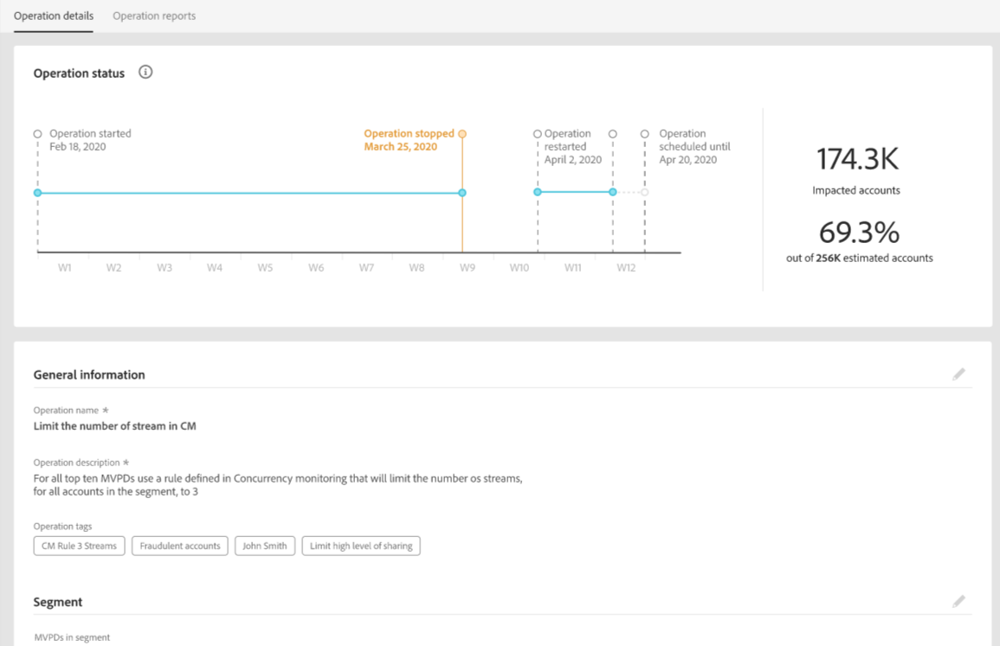

# Opérations {#operations-tab-next-steps}

Une fois que vous avez compris les schémas d’utilisation de vos abonnés et identifié le partage de mot de passe pour le segment sélectionné (à l’aide des rapports et analyses dans le compte IQ), vous pouvez prendre des mesures ciblées pour réduire le partage de mot de passe.

La fonctionnalité Opérations du compte IQ vous aide à gérer et à gérer efficacement le partage des informations d’identification par le biais de procédures ciblées appelées opérations. Il vous offre des options pour concevoir un objectif, personnaliser les actions ciblées (en fonction de l’objectif) pour un groupe spécifique de comptes d’abonnés et automatiser leur exécution pendant une durée ultérieure. Grâce à la fonctionnalité Opérations, vous pouvez non seulement créer et exécuter des opérations, mais également en mesurer l’impact. Ainsi, en évaluant les impacts, vous pouvez ajuster votre stratégie pour optimiser l’effet, que ce soit en convertissant les emprunteurs ou en atténuant le partage des informations d’identification.

Pour afficher **Opérations** page select **Opérations** option sous **Actions** dans le volet de navigation de gauche de l’application Account IQ. La page Opérations répertorie toutes les opérations qui existent déjà sur le système Account IQ, ainsi que leurs détails.

*Figure : Liste et détails des opérations existantes dans le compte IQ*

Sur la page Opérations, vous pouvez effectuer les opérations suivantes :

* Afficher une liste des opérations déjà existantes dans le compte IQ

* Afficher les détails de l’opération, tels que :

   * État (planifié, en cours d’exécution, terminé, erreur ou arrêté)

   * progression (en pourcentage d&#39;achèvement)

   * audience cible (segment sur lequel exécuter l’opération)

   * planning (date de début et de fin de l’opération)

   * création et date de fin de l’opération

* [Créer une opération](/help/AccountIQ/operation-affecting-user-segment.md)

* [Affichage des rapports d’opération](#operation-reports)

<!--* Search from the list of operations using Search field

* Stop an operation.

* Create a duplicate operation.

* [Configure columns of Operations details page](#configure-columns)-->

## Affichage des rapports d’opération {#operation-reports}

Vous pouvez analyser les impacts d’une opération en affichant son rapport. Pour afficher le rapport d’une opération :

1. Sélectionnez le nom de l’opération sur la page Opérations principale.

   Le rapport s&#39;affiche sous la forme d&#39;un graphique en colonnes empilé.

   

   *Figure : Rapport sur les opérations afin de visualiser l&#39;impact des opérations*

   L’axe X représente la période d’évaluation et l’axe Y représente l’impact de l’opération (en termes de nombre de comptes dans un segment pendant la période d’évaluation). Chaque barre est divisée en trois parties.

   * Une partie représente le nombre de comptes qui répondent toujours aux critères du segment d’opération.

   * Une autre partie représente le nombre de comptes actifs pour cette période qui se trouvaient à l’origine dans le segment, mais qui ne répondent plus aux critères du segment d’opération.

   * La troisième partie représente les comptes qui n&#39;ont pas été ouverts au cours de cette période.

   >[!NOTE]
   >
   >La première barre représente le nombre de comptes qui répondent aux conditions du segment d&#39;opération au début de la période d&#39;évaluation.

   Au fil du temps, le graphique montre l’effet de votre action (par le biais de l’opération) en indiquant le nombre de comptes qui ont modifié leur comportement par rapport aux critères d’origine (par exemple, ayant une probabilité de partage supérieure à 90 et utilisant plus de 5 appareils) ou qui sont devenus inactifs.

<!--For example, in the above image the variable on the y-axis is number of accounts. Looking at the graph you can compare the number of accounts that are in the operations' segment versus the number of accounts that are outside the operations segment at a particular time (such as week 2nd of the operations evaluation period). Therefore, you can analyze how over the evaluation period do number of accounts vary within the operation segment and outside the segment.

So, if your operation was to send out warning emails to suspecting accounts, and accounts in operations segment were those with sharing probability more than 90 and using more than 5 devices to stream content, then in the beginning of the evaluation period accounts in segment are more than 17 thousand. This number changes over the evaluation period as shown in the graph, thereby indicating the impact of operation. Based on the evaluation, you can take remedial measures on suspecting accounts, or continue with the operation, or adjust your strategy for better outcomes to curb credential sharing.-->

1. Pour fermer le rapport et revenir à la page Opérations principale, sélectionnez **Opérations** option sous **Actions** dans le volet de navigation de gauche.

<!--

*Figure: Operation details*
## Configure columns {#configure-columns}

You can select the icon to **Configure columns** on the top of the operations table.

*Figure: Configure columns of Operations details page*-->