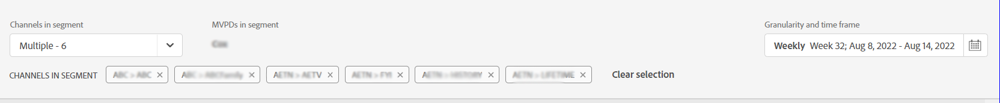

# Segments d’abonné et période {#cohorts-segments}

Lorsque vous vous connectez au compte IQ, un panneau dans la partie supérieure vous permet de définir l’abonné. [segment](/help/AccountIQ/product-concepts.md#segment-segmet-def) pour filtrer vos résultats afin d’afficher des rapports sur le comportement et les modèles de partage des abonnés.

<!---->

+++Panneau de sélection des segments pour le programmeur

<!---->

Les options de liste déroulante suivantes sont utilisées pour définir des segments :

**MVPD dans le segment**

Le **MVPD dans le segment** Le sélecteur vous permet de choisir la [MVPD](/help/AccountIQ/product-concepts.md#mvpd-def) (individus ou groupes) pour l’abonné duquel vous souhaitez afficher les rapports de partage de compte.

Dans ce sélecteur, en plus de sélectionner les MVPD individuels, vous pouvez également sélectionner les groupes suivants :

* [Les 10 meilleurs MVPD en partageant le score](/help/AccountIQ/product-concepts.md#top-mvpds-def)

* [Les 10 principaux distributeurs multicanaux de programmes audiovisuels par utilisation](/help/AccountIQ/product-concepts.md#top-mvpds-def)

* [Les 10 principaux distributeurs multicanaux de programmes audiovisuels par compte](/help/AccountIQ/product-concepts.md#top-mvpds-def)

* [Mode d&#39;isolation](/help/AccountIQ/isolation-mode.md)

**Canaux dans le segment**

Lorsque vous êtes connecté en tant qu’utilisateur programmeur, vous pouvez sélectionner vos canaux pour afficher les analyses de partage de compte. Utilisez la variable **Canaux dans le segment** option de liste déroulante pour sélectionner un ou plusieurs canaux de votre entreprise.

+++

+++Panneau de sélection des segments pour les MVPD

Les options de liste déroulante suivantes sont utilisées pour définir des segments :

**Canaux dans le segment**

Le **Canaux dans le segment** Le sélecteur vous permet de réduire davantage votre filtre pour sélectionner les canaux correspondant aux MVPD sélectionnés.

* [Les 10 premiers programmeurs en partageant le score](/help/AccountIQ/product-concepts.md#top-mvpds-def)

* [Les 10 premiers programmeurs par utilisation](/help/AccountIQ/product-concepts.md#top-mvpds-def)

* [Les 10 premiers programmeurs par compte](/help/AccountIQ/product-concepts.md#top-mvpds-def)

**MVPD dans le segment**

Lorsque vous êtes connecté en tant qu’utilisateur MVPD, votre nom s’affiche dans le champ pour **MVPD dans le segment**.

+++

<!--For example, you can define your segment as the "subscribers of the MVPD A that watched the channels X, Y, and Z".-->

## Granularité et période {#granularity-timeframe}

Le **Granularité et période** sélecteur vous permet de spécifier les dates et la durée, ou la taille de l’heure pour laquelle vous souhaitez afficher le comportement de partage des abonnés.

Ainsi, avec ces contrôles, vous pouvez définir votre énoncé de problème comme &quot;abonnés du MVPD A qui ont regardé les canaux X, Y et Z au cours du mois de mai&quot;.

