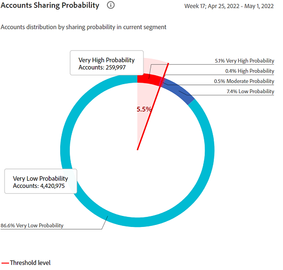

# Rapports sur les comptes partagés {#shared-accounts-reports}

Les rapports Comptes partagés répartissent les mesures, telles que le nombre d’appareils et les types d’appareils, en fonction de la plage de probabilité de partage sélectionnée, par exemple. **Supérieur à la probabilité modérée** et **Supérieur à une faible probabilité** pour le segment actuel.

Ces plages peuvent ensuite servir de seuils définis par l’utilisateur et les graphiques sont mis à jour en fonction des seuils sélectionnés.

Account IQ classe tous les comptes abonnés du segment défini dans les comptes avec les cinq catégories suivantes en fonction de leurs probabilités de partage :

* Très élevé (80 % à 100 %)
* Élevé (60 %-80 %)
* Modéré (40 % à 60 %)
* Faible (20 % à 40 %)
* Très faible (0 à 20 %)

## Probabilité de partage des comptes {#accounts-sharing-probability}

Le graphique en anneau classe et affiche ici les pourcentages (et les nombres absolus) des comptes abonnés de différentes catégories de probabilité.

La ligne rouge indique la plage de seuil sélectionnée par les utilisateurs dans [Comptes supérieurs au seuil dans le segment actuel](#threshold-selector) du panneau.

Le graphique à barres trace le nombre de comptes sur l’axe Y pour différentes catégories de probabilités de partage (tracées sur l’axe X).

La ligne rouge indique la plage du seuil et peut être ajustée dans le graphique à barres. Le seuil ajusté dans le graphique à barres se reflète dans la plage de seuil dans le graphique en anneau.

<!---->

### Comptes supérieurs au seuil dans le segment actuel{#threshold-selector}

Ce panneau vous permet de sélectionner une plage parmi les suivantes comme seuil pour les comptes abonnés (selon leurs probabilités de partage) :

* Comptes **sur très faible** partage **probabilité**

* Comptes **over low** partage **probabilité**

* Comptes **sur modéré** partage **probabilité**

* Comptes **sur élevé** partage **probabilité**

Une fois que vous avez sélectionné le seuil, le panneau affiche le pourcentage (et le nombre) de comptes parmi tous les comptes abonnés des distributeurs multicanaux sélectionnés dans le segment.

## Segment - Lire les requêtes sur le total {#play-request-out-total}

Le graphique en anneau indique le pourcentage (et le nombre) de demandes de lecture effectuées par les abonnés dans le segment ; et vous permet de comparer les demandes de lecture effectuées par des abonnés qui ne se trouvent pas dans le segment défini.

Lorsque vous déplacez le curseur sur le graphique en anneau, il affiche également les pourcentages et les nombres d’abonnés provenant de différentes plages de probabilités.

<!---->

## Segment-Nombre moyen d’appareils par compte{#avg-devices-account}

Le graphique à barres indique le nombre moyen d’appareils de chaque type d’appareil utilisés par les abonnés dans le segment actuel et les abonnés non dans le segment actuel.

## Segment : codes postaux par période par compte {#zip-codes-period-account}

Ce graphique vous indique le nombre d’abonnés qui utilisent du contenu à différents emplacements au cours d’une période.

Vous pouvez effectuer un zoom avant pour réduire et afficher les détails d’une barre du graphique qui trace une plage d’emplacements.

<!---->

## Segment : période/compte géographique {#geo-span-period-account}

Ce graphique à barres trace le nombre de comptes abonnés par rapport à différentes plages géographiques de kilomètres. La plage est basée sur la distance maximale entre les emplacements à partir desquels un abonné a diffusé en continu pendant la période.

<!--Total number of users ...

How many accounts are within 99 miles of each other.....and how many are apart. 

Based on points on the map.-->

Lorsque vous sélectionnez une barre représentant une plage de distances géographiques, elle la développe pour vous afficher plus de détails.

<!---->