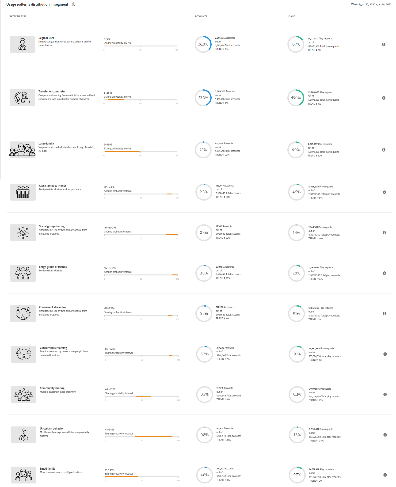

# Modèles d’utilisation {#usage-patterns}

Account IQ classe les utilisateurs des comptes d’abonnés dans différentes catégories en fonction de leur comportement social, comme les voyageurs ou les navetteurs, la grande famille et le partage communautaire. La variable **Modèles d’utilisation** présente plusieurs analyses et rapports différents pour ces typologies d’utilisateurs. Par exemple : **Distribution des modèles d’utilisation - Utilisateurs dans le segment par rapport au total** compare le comportement d’utilisation du segment actuel par rapport à l’ensemble du secteur.

Comme les autres pages de l’application, les analyses et les rapports ici sont basés sur le segment actuel tel que défini dans la variable [panneau des segments](/help/AccountIQ/segments-timeframe.md).

## Distribution des modèles d’utilisation {#usage-pattern-dis}

Le graphique en barres dans **Distribution des modèles d’utilisation - Utilisateurs dans le segment par rapport au total** représente le nombre et le pourcentage d’abonnés pour chaque comportement social ou modèle d’utilisation. En plus de comparer chaque modèle d’utilisation du segment actuel à l’ensemble du secteur, il les compare à un segment contenant tous vos canaux.

## Distribution du modèle d’utilisation dans le segment (#usage-pattern-dis-segment)

La variable **Distribution des modèles d’utilisation dans le segment** panneau présente les informations suivantes pour chaque modèle d’utilisateur :

* Plage de probabilité de partage dans laquelle les comptes individuels sont classés
* Nombre et pourcentage de comptes dans ce modèle
* Utilisation globale et pourcentage par les abonnés de cette catégorie en termes de requêtes de lecture

Par exemple, dans l’image ci-dessus :

* Un utilisateur régulier (de une à quelques personnes avec un nombre limité d’appareils à un seul emplacement) dans le segment défini a une probabilité de partage de compte comprise entre 0 et 5 %.

* Et 36,8 % (2 201 935) des comptes abonnés (5 981 648) sont des utilisateurs réguliers.

* Et 15,7 % (24 073 311) du total des demandes de lecture (153 076 350) sont effectuées par des utilisateurs réguliers.

## Distribution du modèle d’utilisation par partenaire de segment {#usage-pattern-dis-mvpd}

+++Programmeur - Répartition du modèle d’utilisation pour les segments totaux et les partenaires de segments

La variable **Distribution du modèle d’utilisation** Le tableau fournit une comparaison de la distribution des schémas d’utilisation pour les MVPD dans le segment actuel.

+++

+++MVPD : distribution des schémas d’utilisation pour le nombre total de segments et de partenaires de segments.

La variable **Distribution du modèle d’utilisation** Le tableau fournit une comparaison de la distribution des schémas d’utilisation pour les canaux programmeurs dans le segment actuel.

+++
