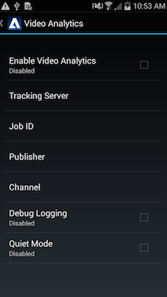

# Configuration des analyses vidéo {#configure-video-analytics}

Vous pouvez suivre l’utilisation des vidéos dans l’implémentation de référence Android Primetime en le configurant pour fonctionner avec votre compte Adobe Analytics. L’implémentation des références Android est conçue pour envoyer les données d’utilisation vidéo et de pulsation à Adobe Analytics. Pour activer cette fonctionnalité, vous devez d’abord contacter votre représentant Adobe Primetime et créer un compte Adobe Analytics.

Vous devez configurer deux emplacements dans l’implémentation des références pour activer l’intégration d’Adobe Analytics. Les configurations d’analyse vidéo à l’exécution prennent effet une fois qu’une nouvelle vidéo est sélectionnée pour la lecture (c.-à-d. une fois qu’une nouvelle activité de lecteur est créée).

1. Configurez les options de temps de chargement dans le fichier `ADBMobileConfig.json` de ressources.

   Ce fichier est fourni par votre représentant Adobe. Il n’est pas inclus par défaut dans le lot du SDK Primetime. Pour plus d’informations sur les paramètres de ce fichier de configuration, consultez le Guide du programmeur Android ici : Initialisez et configurez les analyses vidéo.
1. Configuration des options d’exécution dans le menu des paramètres d’implémentation des références

   

   | Options d’exécution | Description |
   |---|---|
   | Serveur de suivi des analyses vidéo | URL du point de fin de la collection principale d’analyses vidéo. C’est là que sont envoyés tous les appels de suivi de pulsation vidéo. |
   | ID de tâche | Identifiant de la tâche de traitement. Cela indique au point de terminaison principal quel type de traitement appliquer aux appels de suivi vidéo. |
   | Channel | Nom du dans lequel l’utilisateur regarde le contenu. Pour une application mobile, il s’agit généralement du nom de l’application. |
   | Editeur | Nom de l’éditeur de contenu |
   | Journalisation du débogage | Active la journalisation étendue. Désactivé par défaut, cela peut avoir une incidence sur les performances lorsqu’il est activé. Vous désactivez donc cette option pour un  de production . |
   | Mode silencieux | Lorsque cette option est activée, aucun appel réseau n’est effectué. Cela peut donc s’avérer utile pour le débogage local, mais doit être désactivé pour un  de production . |