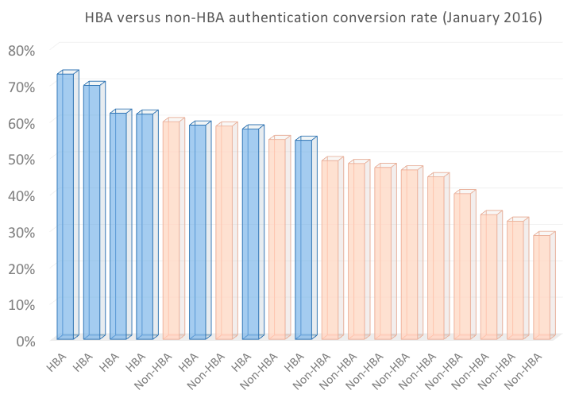

# Authentification basée sur la maison pour TV partout

>[!NOTE]
>
>Le contenu de cette page est fourni à titre d’information uniquement. L’utilisation de cette API nécessite une licence actuelle de Adobe. Aucune utilisation non autorisée n’est autorisée.

## Qu’est-ce que l’authentification basée sur l’accueil ? {#whatis-home-based-authn}

L’authentification basée sur la page d’accueil (adaptatif) est une fonctionnalité TV partout qui permet aux abonnés de la télévision payante d’afficher le contenu TV en ligne sans entrer d’informations d’identification MVPD lorsqu’ils sont à la maison, améliorant ainsi considérablement l’expérience utilisateur du flux d’authentification.

Définition de l’authentification par domicile par l’Open Authentication Technology Committee (OATC) : &quot;L’authentification automatique à la maison est le processus par lequel un MVPD/OVD utilise les caractéristiques du réseau domestique (ou les identifiants automatiquement accessibles entre les appareils sur le réseau domestique) pour authentifier quel compte d’abonné est associé à ce réseau domestique afin que les utilisateurs n’aient pas besoin de saisir manuellement les informations d’identification lors de l’établissement d’une session TVE pour accéder au contenu protégé.&quot;

Pour plus d’informations sur l’adaptateur de bus hôte et les normes du secteur, consultez la section [Cas d’utilisation et exigences du service ATC](https://dzf8vqv24eqhg.cloudfront.net/userfiles/258/326/ckfinder/files/Defining%20TVE%20Home-Based%20Authentication%20(HBA)%20%20Use%20Cases%20and%20Requirements%20Recommended%20Practice%20Version%201_0%20FINAL%20DRAFT%20FOR%20BOARD%20APPROVAL.pdf){target=_blank} documentation et **Consignes d’expérience utilisateur OATC pour l’adaptateur de bus hôte**.

>[!NOTE]
>
>Certains flux de l’adaptateur de bus hôte font partie du package de workflow Premium. Contactez votre représentant commercial Primetime si vous souhaitez utiliser cette fonctionnalité.

## Pourquoi l’adaptateur de bus hôte est important pour vous {#why-hba}

L’adaptateur de bus hôte est important, car il supprime pratiquement la barrière de connexion pour vos visionneuses qui se trouvent à la maison et qui disposent déjà d’un abonnement par câble. En outre, l’authentification par domicile peut augmenter de manière significative l’engagement de vos visiteurs et offrir une meilleure expérience utilisateur pour votre contenu TV partout.

Actuellement, près de la moitié des tentatives de connexion échouent.

Une fois que l’adaptateur de bus hôte a été activé par l’un des 5 principaux MVPD, son taux de conversion d’authentification **augmenté de 40 %** (de 45 % à 63 %)

En outre, vous trouverez ci-dessous le taux de conversion de connexion d’un canal intégré à différents MVPD : ceux qui ont activé l’adaptateur de bus hôte pour celui-ci et ceux qui n’ont pas d’adaptateur de bus hôte. Le taux de conversion pour les personnes qui ont un adaptateur de bus hôte est nettement plus élevé que celles qui n’ont pas d’adaptateur de bus hôte.

Six mois après l’activation de l’adaptateur pour la plupart des canaux intégrés à ce MVPD, nous avons remarqué une augmentation de 82 % des utilisateurs uniques (le nombre d’utilisateurs accédant aux canaux TV partout par le biais de ce MVPD a presque doublé).

2 w3En revanche, comme vous pouvez le voir dans le graphique ci-dessous, d’autres MVPD qui n’avaient pas activé l’adaptateur de bus hôte ont uniquement enregistré une augmentation de 26 % des utilisateurs uniques au cours des 6 derniers mois.

À partir de nos données, collectées 6 mois avant et 6 mois après l’activation de l’adaptateur de bus hôte, nous avons constaté une augmentation majeure de l’engagement des visionneuses pour les canaux pour lesquels l’adaptateur de bus hôte était activé. En pratique, les utilisateurs des distributeurs multicanaux de programmes audiovisuels qui ont activé l’adaptateur de bus hôte ont tendance à regarder en moyenne 30 % plus de contenu que les utilisateurs des distributeurs multicanaux de programmes audiovisuels qui n’ont pas activé l’adaptateur de portable.

## Prise en charge de l’adaptateur de bus hôte d’authentification Primetime {#auth-hba-support}

Cette section décrit la prise en charge de l’adaptateur de bus hôte fournie par l’authentification Primetime, le comportement des plateformes d’authentification Primetime dans les flux d’adaptateur de bus hôte et fournit des détails techniques utiles pour l’implémentation de l’adaptateur de bus hôte.

Fonctionnalités d’authentification Primetime prenant en charge l’adaptateur

* Possibilité de définir différents TTL d’authentification pour les authentifications des adaptateurs de bus hôte par rapport aux non-adaptateurs de l’hôte (nécessite également la prise en charge de MVPD)
* Possibilité de sélectionner automatiquement un MVPD (ignorer le sélecteur MVPD) si l’authentification a expiré. Cela s’avère utile surtout lorsque les TTL des adaptateurs de bus hôte sont petits.
* Possibilité d’exposer aux programmeurs si l’authentification était ou non adaptatif (nécessite également la prise en charge MVPD)

### Expérience utilisateur du adaptateur de bus hôte sur les plateformes d’authentification Primetime {#hba-user-exp}

Les tableaux suivants fournissent des informations sur l’expérience utilisateur des plateformes prises en charge lorsque l’adaptateur de bus hôte est activé et lorsque l’adaptateur de bus hôte n’est pas activé :

| Flux utilisateur - Type de plateforme | swf, iOS, Android |
|---|---|
| Compatibilité avec l’adaptateur | Lorsque les utilisateurs se trouvent à la maison, ils sont automatiquement authentifiés. Une fois que le jeton d’authentification de l’adaptateur adaptatif (adaptatif) arrive à expiration, les utilisateurs sont automatiquement réauthentifiés. |
| Sans adaptateur | Les utilisateurs sont invités à sélectionner leur MVPD et à saisir leurs informations d’identification, même s’ils se trouvent à la maison. Une fois le jeton AuthN expiré, les utilisateurs doivent à nouveau saisir leurs informations d’identification. |

| Flux utilisateur - Type de plateforme | js, Windows (natif) |
|---|---|
| Compatibilité avec l’adaptateur | Lorsque les utilisateurs se trouvent à la maison, ils sont automatiquement authentifiés. Une fois le jeton d’authentification de l’adaptateur de bus hôte expiré, les utilisateurs doivent resélectionner leur MVPD dans le sélecteur et seront automatiquement authentifiés. |
| Sans adaptateur | Les utilisateurs sont invités à sélectionner leur MVPD et à saisir leurs informations d’identification, même s’ils se trouvent à la maison. Une fois le jeton AuthN expiré, les utilisateurs doivent à nouveau saisir leurs informations d’identification. |

| Flux utilisateur - Type de plateforme | API REST sans client (deuxième authentification écran) |
|---|---|
| Compatibilité avec l’adaptateur | Lorsque les utilisateurs sont à la maison et qu’ils utilisent une application API REST sans client, ils sont automatiquement authentifiés sur le deuxième écran de l’appareil après avoir saisi le code d’enregistrement et sélectionné leur MVPD. Une fois que le jeton d’authentification de l’adaptateur adaptatif (adaptatif) arrive à expiration, les utilisateurs sont automatiquement réauthentifiés (sur le deuxième périphérique d’écran). |
| Sans adaptateur | Les utilisateurs sont invités à sélectionner leur MVPD et à saisir leurs informations d’identification, même s’ils se trouvent à la maison. Une fois le jeton AuthN expiré, les utilisateurs doivent à nouveau saisir leurs informations d’identification. |

### Détails techniques de l’implémentation de l’adaptateur de bus hôte {#tech-details-hba}

#### Protocole OAuth 2.0 {#oauth-2-protocol}

Dans le flux de l’adaptateur de bus hôte pour les MVPD intégrés au protocole d’authentification OAuth 2.0, le MVPD émet un jeton d’actualisation et l’Adobe émet un jeton d’authentification de l’adaptateur de bus hôte :

* Le jeton d’actualisation a un délai d’activation (TTL) déterminé par les besoins de l’entreprise du MVPD.
* Jeton d’authentification de l’adaptateur de bus hôte TTL **doit être inférieur ou égal à** le jeton d’actualisation TTL.

*Description du flux d’authentification de l’adaptateur de bus hôte pour le protocole OAuth 2.0*

| Actions des utilisateurs | Actions système |
|---|---|
| L’utilisateur accède au site du programmeur. Lorsque vous essayez de lire une vidéo, le sélecteur MVPD s’affiche. L’utilisateur sélectionne son MVPD et clique sur Connexion. | Un contrôle en arrière-plan est effectué. Le MVPD applique son ensemble de règles pour la détection des utilisateurs (par exemple, mapper l’adresse IP de l’utilisateur à l’adresse MAC des modems configurés pour le distributeur ou des décodeurs connectés à large bande). |
| Un écran, qui persiste pendant environ 3 secondes, s’affiche. Une page de spot peut s’afficher pour informer l’utilisateur qu’il est automatiquement connecté à l’aide de son compte MVPD. | <ol><li>AccessEnabler, installé côté programmeur, envoie une demande d’authentification (en tant que requête HTTP) au point de terminaison de l’authentification Adobe Primetime.</li><li>Le point de terminaison de l’authentification Primetime redirige la requête vers le point de terminaison de l’authentification MVPD.  **Remarque :** La requête contient la variable `hba_flag` (tentative d’utilisation de l’adaptateur de bus hôte = true), qui indique que le MVPD doit essayer l’authentification de l’adaptateur de bus hôte.</li><li>Le point d’entrée d’authentification MVPD envoie un code d’autorisation au point d’entrée d’authentification Adobe Primetime.</li><li>L’authentification Adobe Primetime utilise le code d’autorisation pour demander un jeton d’actualisation et un jeton d’accès à partir du point de terminaison du jeton MVPD.</li><li>Le MVPD envoie une décision d’authentification et la variable `hba_status` (true/false) du paramètre `id_token`.</li><li>Un appel au point de terminaison de profil utilisateur MVPD est envoyé pour exposer la variable [clé hba_status dans les métadonnées utilisateur](/help/authentication/user-metadata-feature.md#obtaining).</li><li>Le MVPD définit le jeton d’actualisation TTL sur une valeur approuvée par le MVPD et l’Adobe définit le jeton AuthN TTL sur une valeur inférieure ou égale à la valeur du jeton d’actualisation.</li></ol> |
| L’utilisateur est authentifié et peut désormais parcourir le contenu intitulé TV partout. | Le jeton d’authentification est transmis à l’utilisateur qui peut désormais parcourir le site du programmeur avec succès. |

#### Protocole SAML {#saml-protocol}

Description du flux d’authentification de l’adaptateur de bus hôte pour le protocole d’authentification SAML

| Actions des utilisateurs | Actions système |
|---|---|
| L’utilisateur accède au site du programmeur. Lorsque vous essayez de lire une vidéo, le sélecteur MVPD s’affiche. L’utilisateur sélectionne son MVPD et clique sur Connexion. | Un contrôle en arrière-plan est effectué. Le MVPD applique son ensemble de règles pour la détection des utilisateurs (par exemple, mapper l’adresse IP de l’utilisateur à l’adresse MAC des modems configurés pour le distributeur ou des décodeurs connectés à large bande). |
| Un écran, qui persiste pendant environ 3 secondes, s’affiche. Une page de spot peut s’afficher pour informer l’utilisateur qu’il est automatiquement connecté à l’aide de son compte MVPD. | <ol><li>AccessEnabler, installé côté programmeur, envoie une demande d’authentification (en tant que requête HTTP) au point de terminaison de l’authentification Adobe Primetime.</li><li>Le point de terminaison de l’authentification Primetime redirige la requête vers le point de terminaison de l’authentification MVPD.</li><li>Le MVPD doit envoyer une décision d’authentification sous la forme d’une réponse SAML qui doit contenir l’indicateur de l’adaptateur de bus hôte : hba_status (true/false).</li><li>Un appel au point de terminaison de profil utilisateur MVPD est envoyé pour exposer la variable [clé hba_status dans les métadonnées utilisateur](/help/authentication/user-metadata-feature.md#obtaining).</li></ol> |
| L’utilisateur est authentifié et peut désormais parcourir le contenu intitulé TV partout. | Le jeton d’authentification est transmis à l’utilisateur qui peut désormais parcourir le site du programmeur avec succès. |

## Comment activer l’adaptateur de bus hôte {#how-to-activate-hba}

* **Protocole OAuth :**
   * Pour activer l’adaptateur de bus hôte, voir [Guide de l’utilisateur du tableau de bord Primetime TVE](/help/authentication/tve-dashboard-user-guide.md)
* **Protocole SAML :** L’authentification basée sur l’accueil est activée côté MVPD. Aucune action n’est requise par le programmeur ou l’Adobe.
Pour plus d’informations sur les MVPD qui prennent en charge l’authentification basée sur l’accueil, voir [État de l’adaptateur de bus hôte pour les MVPD](/help/authentication/hba-status-mvpds.md).

## FAQ {#faqs}

**Question :** Pourquoi la séparation entre l’authentification basée sur l’accueil et les protocoles SAML et OAuth2 ?

**Réponse :** Le flux de l’adaptateur de bus hôte est différent pour les deux protocoles. Du point de vue du programmeur, il n’est pas nécessaire d’agir pour s’assurer que l’adaptateur de bus hôte est activé pour les MVPD SAML, alors que pour les MVPD OAuth2, l’adaptateur de bus hôte peut être activé ou désactivé dans le tableau de bord TVE Primetime.

**Question :** Les utilisateurs doivent-ils renseigner un nom d’utilisateur et un mot de passe la première fois qu’ils s’authentifient lorsque l’adaptateur de bus hôte est activé ?

**Réponse :** Non, le nom d’utilisateur et le mot de passe ne sont pas requis.

**Question :** Comment faire appliquer le contrôle parental ?

**Réponse 1 :** Adobe peut désactiver l’adaptateur de bus hôte pour les intégrations aux canaux qui ont besoin de l’approbation du contrôle parental.

**Réponse 2 :** Adobe travaille avec OATC sur un document d’expérience utilisateur qui recommande de configurer l’expérience de l’adaptateur de bus hôte avec le contrôle parental.

**Question :** Les fournisseurs prenant en charge l’adaptateur de bus hôte disposent-ils de fenêtres TTL plus courtes que pour l’authentification régulière ?

**Réponse :** Le paramètre TTL est configurable. Nous vous recommandons de définir un délai d’activation plus court pour les jetons d’authentification de l’adaptateur de bus hôte afin d’éviter toute mauvaise gestion.

## Informations utiles {#useful-info}

* [Recommendations d’accès instantané (adaptateur de bus hôte)](http://www.ctamtve.com/instantaccess){target=_blank} - par CTAM
* [Exemple de mise en oeuvre de l’adaptateur de bus hôte sur l’application de programmation](https://dzf8vqv24eqhg.cloudfront.net/userfiles/258/326/ckfinder/files/HBA_Flow_Sample.pdf?dc=201604222139-1346){target=_blank} - par Adobe
  <!--* [Home Based Authentication User Experience Guidelines for TV Everywhere](http://oatc.us/Standards/DownloadRecommendedPractices.aspx){target=_blank} - by OATC-->
* [Cas d’utilisation et exigences d’authentification basés sur l’accueil](https://dzf8vqv24eqhg.cloudfront.net/userfiles/258/326/ckfinder/files/Defining%20TVE%20Home-Based%20Authentication%20(HBA)%20%20Use%20Cases%20and%20Requirements%20Recommended%20Practice%20Version%201_0%20FINAL%20DRAFT%20FOR%20BOARD%20APPROVAL.pdf){target=_blank} par OATC
* [Infos sur l’authentification basée sur l’accueil](https://dzf8vqv24eqhg.cloudfront.net/userfiles/258/326/ckfinder/files/AdobeNewsletterHBA.pdf?dc=201604260953-2640){target=_blank} - par Adobe
* [Authentification à l’aide du protocole OAuth 2.0](/help/authentication/authn-oauth2-protocol.md)
* [Authentification avec des MVPD SAML](/help/authentication/authn-usecase.md)
* [Guide de l’utilisateur du tableau de bord Primetime TVE](/help/authentication/tve-dashboard-user-guide.md)
* [Métadonnées utilisateur hba_status](/help/authentication/user-metadata-feature.md#obtaining)
