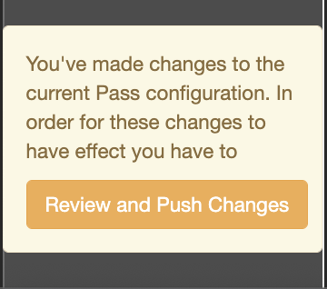
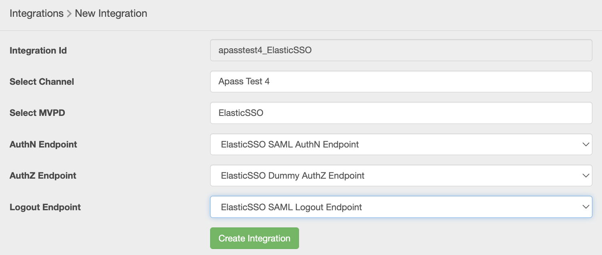

# Guide d’utilisation du tableau de bord Primetime TVE {#tve-db-user-guide}

>[!NOTE]
>
>Le contenu de cette page est fourni à titre d’information uniquement. L’utilisation de cette API nécessite une licence actuelle de Adobe. Aucune utilisation non autorisée n’est autorisée.

## Introduction {#tve-db-intro}

[[!DNL Adobe] Tableau de bord TVE (tableau de bord TVE)](https://console.auth.adobe.com/) est un tableau de bord en libre-service destiné aux utilisateurs travaillant pour des sociétés multimédias (programmeurs) qui entretiennent des relations commerciales avec l’équipe produit Authentification Adobe Primetime .

Contactez votre gestionnaire de compte technique (TAM) pour obtenir l’accès. Pour y accéder, deux nouveaux groupes d’utilisateurs doivent être configurés dans votre organisation Adobe Marketing Cloud :

* Tableau de bord TVE Lecture-écriture : les membres de ce groupe disposent de tous les droits sur toutes les sections modifiables du tableau de bord.
* Tableau de bord TVE en lecture seule : les membres de ce groupe n’ont des droits d’affichage que sur l’ensemble du tableau de bord.

Avant de vous plonger dans ce guide d’utilisation, nous vous recommandons de parcourir les ressources suivantes afin de bien comprendre les flux et les fonctionnalités fournis par l’équipe produit Authentification Adobe Primetime et de vous familiariser avec les termes utilisés dans le présent document :

* [Document technique TVE](/help/authentication/technical-paper.md)
* [Guide de démarrage rapide du programmeur](/help/authentication/programmer-kickstart-guide.md)
* [Flux de droits](/help/authentication/entitlement-flow.md)
* [Glossaire](/help/authentication/glossary.md)

Dans les sections suivantes de ce guide d’utilisation, vous découvrirez comment administrer différents paramètres aux canaux, programmeurs ou intégrations entre canaux et MVPD (Multichannel Video Program Distributors) de votre entreprise.

>[!IMPORTANT]
>Le tableau de bord TVE offre la possibilité de basculer entre un espace de travail de base et un espace de travail avancé. Pour ce faire, faites basculer l’icône dans le coin supérieur droit. L’espace de travail avancé est destiné aux utilisateurs qui possèdent des connaissances techniques approfondies ainsi que des connaissances avancées des fonctionnalités proposées par l’équipe produit Authentification Adobe Primetime.

*Figure 1 : Menu déroulant du tableau de bord Adobe Primetime TVE &quot;Basic / Advanced Workspace&quot;*

## Environnements {#authn-environments}

Selon les tâches qu’un utilisateur peut être tenu d’accomplir, il doit peut-être passer d’un environnement d’authentification Adobe Primetime à un autre. Pour plus d’informations sur les environnements d’authentification Adobe Primetime, consultez le document suivant : [Présentation des environnements d’authentification Adobe Primetime](/help/authentication/understanding-the-adobe-environments.md).

Le tableau de bord TVE fournit deux environnements nommés Préqualification (Préqualification) et Version, chacun ayant deux profils nommés Évaluation et Production, comme illustré ci-dessous :

* [Évaluation préquate](https://console-prequal.auth-staging.adobe.com/)
* [Production prédéfinie](https://console-prequal.auth.adobe.com/)
* [Évaluation des versions](https://console.auth-staging.adobe.com/)
* [Version Production](https://console.auth.adobe.com/)

Pour passer d’un environnement à l’autre, l’utilisateur peut cliquer sur l’environnement souhaité représenté par l’entrée dans la liste déroulante illustrée ci-dessous :

*Figure 2 : Menu déroulant des environnements du tableau de bord Adobe Primetime TVE*

>[!IMPORTANT]
>Il est très important de noter que lorsque vous apportez des modifications administratives à votre configuration de l’authentification Adobe Primetime par le biais du tableau de bord TVE, nous vous conseillons vivement de suivre la séquence ci-dessous afin d’assurer le bon fonctionnement.

Pour apporter des modifications administratives à la configuration de l’authentification Adobe Primetime par le biais du tableau de bord TVE :

* Effectuez les modifications dans [Publication de l’évaluation et validation](http://sp.auth-staging.adobe.com/apitest/api.html).
* Effectuez les modifications dans [Préqualification de la production et validation](http://sp.auth-staging.adobe.com/apitest/api.html).
* Effectuez les modifications dans [Publication de la production et validation](http://sp.auth-staging.adobe.com/apitest/api.html).

>[!IMPORTANT]
>Pour que les modifications administratives soient mises en ligne, les utilisateurs doivent accéder à la section &quot;Révision et Push des modifications&quot; en cliquant sur le bouton qui s’affiche dans la partie inférieure gauche de la barre latérale. Pour passer en revue les modifications, ajoutez une description des modifications nouvellement créées et confirmez la mise à jour de la configuration en sélectionnant &quot;Configuration Push&quot;.

*Figure 3 : Notification de révision et de modification push du tableau de bord TVE d’Adobe Primetime*

## Sections {#sections}

Les utilisateurs travaillant pour des sociétés multimédias (programmeurs) peuvent accéder aux sections suivantes du tableau de bord TVE à partir de la barre latérale :

* **Canaux** - Contient les paramètres relatifs aux fournisseurs de contenu
* **Programmeurs** - Contient des paramètres liés à l’organisation parente qui agrègent un ou plusieurs **Canaux**
* **Intégrations** - Contient les paramètres liés à l’intégration entre **Canaux** et **MVPD**
* **MVPD** - Contient les paramètres liés aux paramètres disponibles **MVPD**
* **Rapports** - Contient des données agrégées pour trois types de rapports : AuthN TTL, AuthZ TTL, SSO
* **Journal des modifications** - Contient les dernières modifications appliquées à la configuration du tableau de bord TVE

*Figure 4 : Sections du tableau de bord TVE d’Adobe Primetime*

### Canaux {#tve-db-channels-section}

Cette section permet d’afficher et de modifier les paramètres des canaux disponibles ou d’en créer un nouveau. Cliquer sur l’un des canaux disponibles renvoie un écran avec les onglets suivants :

* **Données du canal**
   * **Identifiant de canal** - Identifiant unique du canal utilisé dans notre système, également appelé &quot;ID du demandeur&quot;.
   * **Nom d’affichage** - Nom commercial du canal.
* **Paramètres généraux**
   * **Configuration Analytics** - Configurez les événements d’authentification Adobe Primetime à transférer vers Adobe Analytics. Pour plus d’informations sur la configuration de l’identifiant de suite de rapports (RSID) avant d’activer cette fonctionnalité, contactez l’Adobe.
* **Certificats**

  Contient la liste des certificats utilisés dans le flux d’authentification avec leur organisme d’émission, la date d’émission et la date d’expiration. Ces certificats servent de clés privées/publiques et sont utilisés à des fins de validation.
* **Domaines**

  Contient la liste des domaines à partir desquels le canal respectif communiquera avec l’authentification Adobe Primetime.
* **Intégrations**

  Contient la liste des intégrations avec les MVPD disponibles, avec le statut de chaque intégration qui peut être activée ou non. Pour accéder à la page Intégration , cliquez sur une entrée spécifique.
* **Applications enregistrées**

  Contient la liste des enregistrements d’application. Pour plus d’informations, consultez le document [Gestion dynamique de l&#39;enregistrement des clients](/help/authentication/dynamic-client-registration-management.md).

* **Schémas personnalisés**

  Contient la liste des schémas personnalisés. Pour plus d’informations, voir [Enregistrement de l’application iOS/tvOS](/help/authentication/iostvos-application-registration.md) et [Gestion dynamique de l&#39;enregistrement des clients](/help/authentication/dynamic-client-registration-management.md)

#### Ajout/suppression de domaines {#add-delete-domains}

Pour lancer le processus d’ajout d’un nouveau domaine pour le canal sélectionné, vous devez cliquer sur le bouton &quot;Ajouter un nouveau domaine&quot; sous la liste Domaines. Cela crée une nouvelle entrée de domaine dans laquelle vous pouvez spécifier le nom de domaine. S’il existe déjà un domaine plus générique dans la liste des domaines, il est déconseillé d’ajouter un nouveau sous-domaine.

*Figure : Onglet Domaines dans les canaux*

### Programmeurs {#tve-db-programmers-section}

Cette section permet d’afficher et de modifier les paramètres des programmeurs disponibles ou d’en créer un nouveau. Cliquez sur l’un des programmeurs disponibles pour renvoyer un écran avec les onglets suivants :

* **Données du programmeur**
   * **Identifiant du programmeur** - Identifiant unique du programmeur utilisé dans notre système.
   * **Nom d’affichage** - Nom commercial du programmeur.
   * **URL du logo** - Localisateur de ressource uniforme (URL) du logo commercial du programmeur.
   * **Aperçu du logo** - Aperçu du logo commercial du programmeur en le téléchargeant à partir du localisateur de ressource uniforme ci-dessus (URL).

* **Certificats**

  Contient la liste des certificats utilisés dans le flux d’authentification avec leur organisme d’émission, la date d’émission et la date d’expiration. Ces certificats servent de clés privées/publiques et sont utilisés à des fins de validation.

* **Canaux**

  Contient la liste des canaux appartenant à ce programmeur spécifique. Pour accéder à la section Canaux , cliquez sur une entrée spécifique.

* **Applications enregistrées**

  Contient la liste des enregistrements d’application. Pour plus d’informations, voir [Gestion dynamique de l&#39;enregistrement des clients](/help/authentication/dynamic-client-registration-management.md).

* **Schémas personnalisés**

  Contient la liste des schémas personnalisés. Pour plus d’informations, voir [Enregistrement de l’application iOS/tvOS](/help/authentication/iostvos-application-registration.md) et [Gestion dynamique de l&#39;enregistrement des clients](/help/authentication/dynamic-client-registration-management.md).

### Intégrations {#tve-db-integrations-sec}

Cette section permet d’afficher et de modifier les paramètres pour les intégrations entre les canaux et les MVPD disponibles ou d’en créer un nouveau. Cliquer sur l’une des intégrations disponibles renvoie une seule page lors de l’utilisation de l’espace de travail de base ou un écran avec les onglets suivants lors de l’utilisation de l’espace de travail avancé :

* **Données d’intégration**
   * **Identifiant d’intégration**- Résultat de l’ajout de l’identifiant unique des MVPD à l’identifiant unique du canal séparé par le caractère &quot;_&quot;.
   * **Nom d’affichage du canal** - Nom commercial du canal.
   * **Identifiant de canal** - Identifiant unique du canal utilisé dans notre système, également appelé &quot;ID du demandeur&quot;.
   * **Nom d’affichage MVPD** - Nom commercial du MVPD.
   * **MVPD Id** - Identifiant unique du MVPD utilisé dans notre système.
* **Paramètres généraux**
   * **Clés de métadonnées utilisateur** - Configurez les clés de métadonnées disponibles pour l’intégration spécifique.
   * **Paramètres spécifiques à la plateforme** - Configurez différents paramètres sur une plateforme spécifique (par exemple, TTL, SSO et IFrames).

* **Paramètres d’authentification**
   * Contient les paramètres liés à la fonctionnalité d’authentification d’Adobe Primetime.
* **Paramètres d’autorisation**
   * Contient les paramètres liés à la fonction d’autorisation d’authentification Adobe Primetime.
* **Paramètres de connexion**
   * Contient les paramètres liés à la fonction de déconnexion de l’authentification Adobe Primetime.

#### Création d’une intégration {#create-integration}

Pour créer une intégration, procédez comme suit :

* cliquez sur le bouton &quot;Ajouter une nouvelle intégration&quot;.
* recherche et sélection d’un canal
* rechercher et sélectionner un MVPD ;
* attendez que le tableau de bord TVE calcule &quot;ID d’intégration&quot; et affiche les points de terminaison MVPD disponibles.
* sélectionnez les points de fin d’authentification, d’autorisation et de déconnexion ou utilisez les valeurs par défaut.
* Cliquez sur le bouton &quot;Créer une intégration&quot;.
* Selon les paramètres MVPD, une fenêtre contextuelle peut s’afficher et demander des propriétés supplémentaires, qui auraient dû être fournies au préalable par le MVPD. Dans le cas contraire, une redirection vers la page d’intégration nouvellement créée aura lieu.

*Figure 5. Fenêtre Nouvelle intégration du tableau de bord Adobe Primetime TVE*

#### Mise à jour de l’intégration {#update-integration}

Pour mettre à jour une intégration existante, cliquez sur l’entrée de tableau pour cette intégration spécifique à partir de la section Intégrations ou de la section Canaux , qui contient un onglet Intégrations .

Lorsque vous utilisez le mode Espace de travail de base, cette section vous permet d’afficher et de modifier les paramètres les plus fréquemment mis à jour, tels que les TTL (durée de vie) des jetons d’authentification et d’autorisation, ainsi que les paramètres d’iFrame. Notez que les paramètres TTL peuvent être manquants pour les intégrations avec les MVPD qui prennent en charge la persistance des jetons définie de manière dynamique (voir l’entrée 1.19 à partir de [Conditions d’intégration MVPD](/help/authentication/mvpd-integr-features.md)).

Lorsque vous utilisez le mode Espace de travail avancé, cette section vous permet d’afficher et de modifier des paramètres moins courants.

Dans le cas des modes de base et d’espace de travail avancé, ces paramètres peuvent être modifiés au niveau de la plateforme (par exemple, sélectionnez une valeur personnalisée pour le jeton TTL d’autorisation sur Android, valeur par défaut sur toutes les autres plateformes).

>[!IMPORTANT]
>Il est important de comprendre la chaîne d’héritage des paramètres : MVPD -> MVPD Endpoint -> Intégration -> Plateforme, où Platform a la valeur la plus spécifique et MVPD la valeur par défaut la plus générique.

*Figure 6. Le composant de chaîne d’héritage de la propriété Tableau de bord TVE Adobe Primetime*

#### Paramètres spécifiques à la plateforme {#platform-sp-settings}

Cette sous-section peut être utilisée pour remplacer les paramètres de plateformes spécifiques. Les plateformes disponibles sont les suivantes :

* **Toutes les plateformes** - Définissez des valeurs qui seront appliquées à toutes les plateformes, indépendamment des implémentations du programmeur, au cas où aucune autre valeur n’est définie pour une plateforme spécifique.
* **Android** - Définissez les valeurs qui seront appliquées aux implémentations du programmeur sur le SDK Android d’authentification Adobe Primetime.
* **API REST sans client** - Définissez les valeurs qui seront appliquées aux implémentations du programmeur sur l’API REST d’authentification Adobe Primetime.
* **FireTV** - Définissez les valeurs qui seront appliquées aux mises en oeuvre du programmeur sur le SDK Adobe Primetime Authentication FireTV.
* **SDK FLASH** - Cette plateforme est obsolète. **obsolète**
* **SDK JavaScript** - Définissez les valeurs qui seront appliquées aux implémentations du programmeur sur le SDK JavaScript d’authentification Adobe Primetime.
* **Roku** - Définissez des valeurs qui seront appliquées aux implémentations du programmeur sur l’API REST d’authentification Adobe Primetime et qui envoient &quot;Roku&quot; comme type d’appareil. Cette priorité est accordée aux valeurs définies pour la plateforme API REST sans client dans le cas des appareils Roku.
* **SDK natif Xbox** - Cette plateforme est obsolète. **obsolète**
* **API REST Xbox 360** - Définissez des valeurs qui seront appliquées aux implémentations du programmeur sur l’API REST d’authentification Adobe Primetime et qui envoient &quot;xbox&quot; comme type d’appareil. Cette priorité est accordée aux valeurs définies pour la plateforme API REST sans client dans le cas des appareils Xbox 360.
* **API REST Xbox One** - Définissez des valeurs qui seront appliquées aux implémentations du programmeur sur l’API REST d’authentification Adobe Primetime et qui envoient &quot;xboxOne&quot; comme type d’appareil. Cela prévaut sur les valeurs définies pour la plateforme d’API REST sans client dans le cas des appareils XboxOne.
* **iOS** - Définissez les valeurs qui seront appliquées aux implémentations du programmeur sur le SDK iOS d’authentification Adobe Primetime.
* **tvOS** - Définissez les valeurs qui seront appliquées aux implémentations du programmeur sur le SDK tvOS de l’authentification Adobe Primetime.

*Figure 7. Paramètres spécifiques à la plateforme de tableau de bord TVE Adobe Primetime*

#### Activation de la connexion unique à Platform {#enable-platform-sso}

Pour activer/désactiver l’authentification unique pour une intégration et une plateforme spécifiques, procédez comme suit :

* Assurez-vous d’utiliser le mode Espace de travail avancé
* accéder à l’intégration souhaitée ;
* accédez à la **Paramètres généraux** tab
* sélectionnez la plateforme sur laquelle vous souhaitez activer ou désactiver l’authentification unique
* bascule **Activer la connexion unique** Indicateur de la valeur souhaitée (Oui/Non)

  >[!IMPORTANT]
  >Il est important de noter que le **Activer la connexion unique** L’indicateur n’est disponible que pour les plateformes iOS, tvOS, Roku et FireTV, et uniquement pour les intégrations avec des MVPD qui prennent en charge l’authentification unique pour ces plateformes.

* bascule **Application des autorisations de Platform** Indicateur de la valeur souhaitée (Oui/Non)

  >[!IMPORTANT]
  >Il est important de noter que le **Application des autorisations de Platform** L’indicateur contrôle si la décision de l’utilisateur d’autoriser ou de refuser l’accès à sa plate-forme à son abonnement de fournisseur de télévision est appliquée ou non. En prenant en compte le scénario lorsque **Activer la connexion unique** L’indicateur est défini sur &quot;Oui&quot;, **Application des autorisations de Platform** L’indicateur est également défini sur &quot;Oui&quot; et l’utilisateur choisit de refuser l’accès de la plateforme à son abonnement au fournisseur de télévision, puis l’application (canal) correspondante ne pourra pas utiliser le jeton d’authentification Adobe Primetime obtenu par une autre application (canal).

#### Activation de l’authentification par domicile {#enable-hba}

Suivez les étapes ci-dessous pour activer/désactiver l’authentification de base d’accueil pour **OAuth2** MVPD basés sur :

* Assurez-vous d’utiliser le mode Espace de travail avancé
* accéder à l’intégration souhaitée ;
* accéder à **Paramètres d’authentification** tab
* accéder à **Règles dynamiques AuthN** sous-onglet
* bascule **Tenter l’adaptateur de bus hôte** Indicateur de la valeur souhaitée (Oui/Non)

>[!IMPORTANT]
>Gardez à l’esprit que la valeur de &quot;TTL de l’adaptateur de bus hôte AuthN&quot; ne doit jamais être remplacée, faute de quoi le flux d’autorisation pourrait échouer de manière inattendue.

Contacter pour **tve-support@adobe.com** pour plus d’informations sur l’activation de l’authentification de base d’accueil pour les MVPD basés sur SAML.

### MVPD {#tve-db-mvpds-sec}

Cette section permet d’afficher les paramètres des MVPD disponibles. Cliquer sur l’un des MVPD disponibles renvoie un écran avec les onglets suivants :

* **Données MVPD**
   * **MVPD Id** - Identifiant unique du MVPD utilisé dans notre système.
   * **Nom d’affichage** - Nom commercial du MVPD qui peut être utilisé dans le sélecteur de l’utilisateur.
   * **URL du logo** - Localisateur de ressource uniforme (URL) du logo commercial du MVPD.
   * **Aperçu du logo** - Aperçu du logo commercial du MVPD en le téléchargeant à partir du localisateur de ressource uniforme ci-dessus (URL).
* **Paramètres généraux**
   * **Clés de métadonnées utilisateur**
      * Clés de métadonnées disponibles pour le MVPD spécifique.
   * **Propriétés des données client**
      * **Auth/Aggregator** - Si la valeur est &quot;Oui&quot;, un nouveau jeton d’authentification est nécessaire pour chaque nouveau canal auquel l’utilisateur tente d’accéder.
      * **AuthN passif activé** - Si l’indicateur Auth/Aggregator est défini sur &quot;Oui&quot; et que l’option AuthN passif activée est définie sur &quot;Oui&quot;, le processus d’authentification avec un autre canal se produit en arrière-plan sans qu’il faille rediriger entièrement le navigateur et que le sélecteur s’affiche.
      * **Session d’authentification/de navigateur** - Si la valeur est définie sur &quot;Oui&quot;, l’utilisateur est déconnecté après la fermeture du navigateur. S’il est défini sur &quot;Non&quot;, l’utilisateur peut redémarrer le navigateur et rester connecté.
      * **IFrame obligatoire** - Si la valeur est &quot;Oui&quot;, cela indique que la fenêtre de connexion MVPD nécessite un iFrame. Les champs &quot;Largeur de l’iFrame&quot; et &quot;Hauteur de l’iFrame&quot; représentent la taille requise pour l’iFrame qui charge la page de connexion MVPD.
* **Paramètres d’authentification**
   * **Sélectionner le point de fin**
      * Ce champ indique le ou les points d’entrée d’authentification exposés par le MVPD. Le point de terminaison peut varier en fonction du protocole d’authentification utilisé.
   * **Paramètres généraux d’AuthN**
      * Ce sous-onglet affiche le protocole d&#39;authentification utilisé par le MVPD et les informations relatives au protocole.
   * **Certificats AuthN**
      * Ce sous-onglet affiche les certificats utilisés par le MVPD dans le flux d’authentification aux côtés de l’organisation de l’émetteur, la date d’émission et la date d’expiration. Ces certificats servent de clés privées/publiques et sont utilisés à des fins de validation.
   * **Règles dynamiques AuthN**
      * Ce sous-onglet affiche les règles qui s&#39;appliquent au processus d&#39;authentification. En appuyant sur la requête / réponse / jeton du diagramme, vous pouvez voir comme surligné les paramètres appliqués à cette partie du flux d’authentification.
* **Paramètres d’autorisation**
   * **Sélectionner le point de fin**
      * Ce champ indique le point de terminaison d’autorisation exposé par le MVPD. Le point de terminaison peut varier en fonction du protocole d’autorisation utilisé. Les protocoles d’autorisation disponibles sont SOAP, REST (pour les appareils sans client), SAML, XACML et OAUTH.
   * **Paramètres généraux d’AuthZ**
      * Ce sous-onglet affiche le protocole d’autorisation utilisé par le MVPD et les informations relatives au protocole.
      * **Configuration du contrôle en amont**
         * Il décrit le nombre de ressources qui peuvent être préautorisées par un MVPD dans un seul appel, le modèle PreFlight utilisé, ainsi que le seuil de dépassement de délai. Le nombre de ressources peut parfois être différent pour une intégration donnée. Cela peut être géré en modifiant le **Nombre max. de ressources de contrôle en amont**&quot;, disponible sous l’onglet Paramètres généraux . Cette propriété est disponible uniquement pour une intégration donnée et, si elle est définie, elle sera utilisée à la place de la valeur définie dans Paramètres d’autorisation -> Configuration de pré-vol -> Ressources max. de pré-vol.
      * **Protection DOS**
         * Il décrit la protection du refus de service sur le point de terminaison d’autorisation MVPD. Pour obtenir une description exacte de chaque champ, reportez-vous aux info-bulles en survolant les champs de protection DOS.
      * Si le MVPD est un **TempPass**, puis la variable **Paramètres généraux d’AuthZ** contient également des informations concernant la durée TempPass.
      * Si le MVPD est un **FlexibleTempPass**, puis la variable **Paramètres généraux d’AuthZ** contient également des informations concernant la durée TempPass, le nombre maximal de ressources et le champ d’identification (voir l’image ci-dessous).
   * **Certificats AuthZ**
      * Ce sous-onglet affiche les certificats utilisés par le MVPD dans le flux d’autorisation aux côtés de l’organisme émetteur, la date d’émission et la date d’expiration. Ces certificats servent de clés privées/publiques et sont utilisés à des fins de validation.
   * **Règles dynamiques AuthZ**
      * Ce sous-onglet affiche les règles qui s&#39;appliquent au processus d&#39;autorisation. En appuyant sur le diagramme **Request / Response / Token**, vous pouvez voir en surbrillance les paramètres appliqués à cette partie du flux d’autorisation.
* **Paramètres de connexion**
   * **Sélectionner le point de fin**
      * Ce champ indique le point de terminaison de déconnexion exposé par le MVPD. Les protocoles fournis peuvent être SAML ou OAuth2.
      * **Paramètres généraux de connexion**
         * Ce sous-onglet affiche le protocole de déconnexion utilisé par le MVPD et les informations relatives au protocole.
         * **Require Logout Response Signed** - Si elle est définie sur &quot;Oui&quot;, la réponse doit être signée par un certificat approuvé.
      * **Certificats de déconnexion**
         * Ce sous-onglet affiche les certificats utilisés par le MVPD dans le flux de déconnexion, ainsi que leur organisation émetteur, la date d’émission et la date d’expiration. Ces certificats servent de clés privées/publiques et sont utilisés à des fins de validation.
      * **Déconnexion des règles dynamiques**
         * Ce sous-onglet affiche les règles qui s&#39;appliquent au processus de déconnexion. En appuyant sur le diagramme **Request / Response / Token**, vous pouvez voir en surbrillance les paramètres appliqués à cette partie du flux de déconnexion.

### Rapports {#tve-db-reports-sec}

Pour accéder à cette section, cliquez sur &quot;Rapports&quot; dans le[Sections du tableau de bord](#sections)&quot;. Vous accédez alors à un écran de 3 onglets, qui sera présenté en détail dans les sous-sections suivantes : [Rapports TTL AuthN](#authn-ttl-reports), [Rapports TTL AuthZ](#authz-ttl-reports), [Rapports SSO](#sso-reports).

Cette section permet d’afficher et d’exporter des données agrégées pour plusieurs types de rapports pour votre ou vos intégrations de canaux avec divers MVPD sur toutes les plateformes.

#### Plateformes {#report-platforms}

Tous les rapports combinent les valeurs sur les plateformes suivantes :

**NAVIGATEURS**
Affiche les valeurs qui seront appliquées aux mises en oeuvre du programmeur par le biais du SDK JavaScript de l’authentification Adobe Primetime.

**MOBILE : IOS**
Affiche les valeurs qui seront appliquées aux mises en oeuvre du programmeur par le biais du SDK iOS d’authentification Adobe Primetime.

**MOBILE : ANDROID**
Affiche les valeurs qui seront appliquées aux mises en oeuvre du programmeur sur le SDK Android d’authentification Adobe Primetime.

**MOBILE : AUTRES**
Affiche les valeurs qui seront appliquées aux implémentations du programmeur via l’API REST d’authentification Adobe Primetime développée pour les appareils mobiles.

**TVCD : ROKU**
Affiche les valeurs qui seront appliquées aux implémentations du programmeur sur l’API REST d’authentification Adobe Primetime et qui envoient &quot;Roku&quot; comme type d’appareil.

**TVCD : FIRETV**
Affiche les valeurs qui seront appliquées aux mises en oeuvre du programmeur sur le SDK Adobe Primetime Authentication FireTV.

**TVCD : APPLETV**
Affiche les valeurs qui seront appliquées aux mises en oeuvre du programmeur par le biais du SDK tvOS de l’authentification Adobe Primetime.

**TVCD : AUTRES**
Affiche les valeurs qui seront appliquées aux mises en oeuvre du programmeur via l’API REST d’authentification Adobe Primetime développée pour les appareils connectés à la télévision.

**PLATFORM : INCONNU**
Affiche les valeurs qui seront appliquées aux implémentations du programmeur pour lesquelles les services d’authentification Adobe Primetime détectent un type d’appareil inconnu.

Examinez le mécanisme de [transmission des informations client](/help/authentication/passing-client-information-device-connection-and-application.md) aux API REST d’authentification Adobe Primetime ou aux SDK pour plus d’informations sur la manière d’envoyer le type d’appareil souhaité (par exemple, &quot;Roku&quot;).

Tous les rapports combinent les valeurs calculées selon la configuration spécifique à chaque environnement d&#39;authentification Adobe Primetime. Par conséquent, vous pouvez vous attendre à des données de rapport différentes lors du changement entre différents environnements de tableau de bord TVE.

Veuillez consulter la section [Environnements](#authn-environments) pour plus d’informations sur les environnements disponibles d’authentification Adobe Primetime.

##### Sélection de canaux/MVPD spécifiques {#selecting-specific-channels-mvpds}

Tous les rapports permettent d’utiliser des filtres en sélectionnant des canaux spécifiques ou des MVPD spécifiques à inclure dans les rapports résultants.

Pour sélectionner un ou plusieurs canaux, utilisez le **liste déroulante** placé après le libellé &quot;Canaux sélectionnés pour le rapport&quot;. Voir la figure 8./9./10. images ci-dessous.

Pour sélectionner un ou plusieurs MVPD, utilisez la variable **liste déroulante** placé après le libellé &quot;MVPD sélectionnés pour le rapport&quot;. Voir la figure 8./9./10. images ci-dessous.

Par défaut, les données sont agrégées sur tous les canaux de votre entreprise (&quot;Tous les canaux&quot;) et les MVPD avec lesquels elles sont intégrées (&quot;Tous les MVPD&quot;).

Si vous choisissez de désélectionner &quot;Tous les canaux&quot; ou &quot;Tous les MVPD&quot; sans choisir d’options spécifiques, l’interface utilisateur affiche un espace réservé &quot;Aucune donnée disponible&quot;.

##### Exporter le rapport {#export-report}

Tous les rapports permettent d’exporter des données au format CSV (valeurs séparées par des virgules).

Pour exporter des données, utilisez le bouton &quot;Exporter le rapport&quot; situé dans le coin supérieur droit de la fenêtre. Voir la figure 8./9./10. images ci-dessous.

Un fichier nommé **Report.csv** sera téléchargé automatiquement sur votre ordinateur. Par conséquent, assurez-vous que les paramètres de votre navigateur permettent de télécharger les fichiers.

L’icône de chargement &quot;Export de données&quot; s’affiche à l’écran pendant que le fichier Report.csv est calculé, ce qui peut prendre la forme **à quelques minutes** selon la taille des données à exporter.

#### Rapports TTL AuthN (#authn-ttl-reports)

Ce rapport affiche la durée de vie (TTL) du jeton d’authentification configuré pour votre ou vos intégrations de canaux avec divers MVPD sur toutes les plateformes.

Durée de vie du jeton d’authentification, également appelé **AuthN TTL**, s’affiche dans des valeurs lisibles par l’utilisateur, telles que : **jours, heures, minutes, secondes**.

En termes d’expérience utilisateur, les rapports TTL AuthN vous permettent d’inspecter visuellement le temps d’authentification d’un utilisateur en fonction d’un MVPD spécifique et d’une plateforme spécifique.

Pour accéder à ce type de rapport, cliquez sur l’onglet &quot;Rapports TTL AuthN&quot; dans la section &quot;Rapports&quot;.

*Figure 8 : Onglet Rapport TTL du tableau de bord TVE d’Adobe Primetime*

Le tableau Rapports TTL AuthN contient des pages et peut être défilé horizontalement et verticalement selon la taille de l’écran.

Si vous envisagez d’apporter une modification à une valeur TTL AuthN, veuillez consulter [Intégrations](#tve-db-integrations-sec) .

>[!IMPORTANT]
>Le &quot;**Défini par MVPD**&quot; est utilisé dans les cas où le MVPD est celui qui applique la valeur AuthN TTL et non la configuration de l’authentification Adobe Primetime.

#### Rapports TTL AuthZ {#authz-ttl-reports}

Ce rapport affiche la durée de vie (TTL) du jeton d’autorisation configuré pour votre ou vos intégrations de canaux avec divers MVPD sur toutes les plateformes.

Durée de vie du jeton d’autorisation, également appelé **AuthZ TTL**, s’affiche dans des valeurs lisibles par l’utilisateur, telles que : **jours, heures, minutes, secondes**.

En termes d’expérience utilisateur, les rapports TTL AuthZ vous permettent d’inspecter visuellement le temps qu’un utilisateur sera autorisé en fonction d’un MVPD spécifique et d’une plateforme spécifique.

Pour accéder à ce type de rapport, cliquez sur l’onglet &quot;Rapports TTL AuthZ&quot; dans la section &quot;Rapports&quot;.

*Figure 9. Onglet Rapport TTL du tableau de bord TVE d’Adobe Primetime*

Le tableau Rapports TTL AuthZ contient des pages et peut être défilé horizontalement et verticalement selon la taille de l’écran.

Si vous envisagez d’apporter une modification à une valeur TTL AuthZ, reportez-vous à la section [Intégrations](#tve-db-integrations-sec) .

>[!IMPORTANT]
>Le &quot;**Défini par MVPD**&quot; est utilisé dans les cas où le MVPD est celui qui applique la valeur AuthZ TTL et non la configuration de l’authentification Adobe Primetime.

#### Rapports SSO {#sso-reports}

Ce rapport affiche l’état de connexion unique (SSO) configuré pour votre/vos intégration(s) de canal(s) avec divers MVPD sur toutes les plateformes.

État de connexion unique, également appelé **état SSO**, s’affiche sous la forme d’un tri-état avec les valeurs possibles suivantes : **SSO désactivé, SSO activé, SSO incertain**.

En termes d’expérience utilisateur, les rapports d’authentification unique vous permettent d’examiner visuellement l’expérience d’authentification unique de l’utilisateur attendue en fonction d’un MVPD spécifique et d’une plateforme spécifique.

Pour accéder à ce type de rapport, cliquez sur le lien **Rapports SSO**&quot; à partir du **Rapports**&quot;.

*Figure 10 : Onglet Rapports SSO du tableau de bord TVE d’Adobe Primetime*

Le tableau Rapports d’authentification unique contient des pages et peut être défilé horizontalement et verticalement selon la taille de l’écran.

Si vous envisagez d’apporter une modification à un état d’authentification unique, veuillez consulter la section [Intégrations](#tve-db-integrations-sec) .

>[!IMPORTANT]
>&quot;**SSO incertain**&quot;un espace réservé est utilisé dans les cas où la connexion unique est activée et possible, mais les paramètres de la plateforme utilisateur/les décisions de l’utilisateur (par exemple, l’option du navigateur utilisateur pour bloquer les cookies tiers, l’utilisateur choisissant de refuser l’accès à sa plateforme à son abonnement au fournisseur de télévision) ou les paramètres MVPD (par exemple, MVPD demandant l’authentification pour chaque canal) peuvent empêcher la connexion unique.

### Journal des modifications {#tve-db-changelog-sec}

Cette section affiche la liste de toutes les modifications apportées à l’environnement et à la configuration de l’authentification Adobe Primetime par le biais du tableau de bord TVE.

Certaines colonnes indiquent la date de notification push, l’utilisateur qui a effectué la modification et l’état de la notification push.

Cette section permet également de comparer deux entrées de la table afin d’affiner les modifications spécifiques que vous souhaitez examiner et même de partager la comparaison sous forme d’élément de courrier.

### Commentaires {#tve-db-feedback-sec}

Cette section permet aux utilisateurs d’envoyer des commentaires. Suivez les étapes pour fournir des commentaires à l’équipe produit Authentification Adobe Primetime :

* cliquez sur le bouton &quot;Commentaires&quot; dans la partie droite de l’écran.
* saisir l&#39;objet
* saisir le message
* Si nécessaire, téléchargez une capture d’écran du message en cliquant sur le bouton &quot;Télécharger la capture d’écran&quot;.
* cliquez sur le bouton &quot;Envoyer&quot;.

*Figure 11 : Section Commentaires du tableau de bord TVE Adobe Primetime*

Pour obtenir des instructions sur la capture d’écran, consultez les liens ci-dessous :

* [Comment capturer des captures d’écran sous Windows](https://support.microsoft.com/en-us/windows/use-snipping-tool-to-capture-screenshots-00246869-1843-655f-f220-97299b865f6b#1TC=windows-7)

* [Comment capturer des captures d’écran sur Mac](https://support.apple.com/en-us/HT201361)

## Dépannage {#tve-db-troubleshoot}

### Mode de maintenance {#maintenance-mode}

*Figure : Application TVE en mode de maintenance*

Si le tableau de bord TVE est en &quot;mode de maintenance&quot;, les utilisateurs ne pourront pas afficher ni apporter de nouvelles modifications.

Si cela se produit, vous devrez attendre que l’équipe d’ingénierie Authentification Adobe Primetime termine le travail de maintenance sur le tableau de bord TVE.

### État dégradé {#degraded-state}

*Figure : Application TVE dans un état dégradé*

Si le tableau de bord TVE est &quot;dégradé&quot;, les utilisateurs n’auront pas de fonctionnalités de recherche et de tri, mais ils pourront afficher ou apporter de nouvelles modifications.

Si cela se produit, vous devrez attendre que l’équipe d’ingénierie Authentification Adobe Primetime termine le travail de maintenance sur le tableau de bord TVE.
