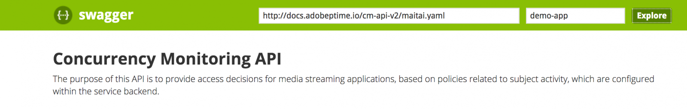

# Présentation de l’API {#api-overview}

Afficher la variable [documentation de l’API en ligne](http://docs.adobeptime.io/cm-api-v2/) pour plus d’informations.

## Objectif et conditions préalables {#purpose-prerequisites}

Ce document aide les développeurs d’applications à utiliser notre spécification API Swagger lors de l’implémentation d’une intégration avec la surveillance de la simultanéité. Il est vivement recommandé que le lecteur ait une compréhension antérieure des concepts définis par le service avant de suivre cette directive. Pour que cette compréhension soit possible, il est nécessaire de disposer d’une vue d’ensemble du [documentation du produit](/help/concurrency-monitoring/cm-home.md) et la variable [Spécification de l’API Swagger](http://docs.adobeptime.io/cm-api-v2/).

## Introduction {#api-overview-intro}

Au cours du processus de développement, la documentation publique Swagger représente la ligne directrice de référence pour comprendre et tester les flux d’API. Il s’agit d’un excellent point de départ pour une approche pratique et pour vous familiariser avec le comportement des applications réelles dans différents scénarios d’interaction utilisateur.

Envoyer un ticket dans [Zendesk](mailto:tve-support@adobe.com) pour enregistrer votre société et vos applications dans Surveillance de la simultanéité. Adobe attribuera un ID d’application à chaque entité. Dans ce guide, nous utiliserons deux applications de référence avec des id **demo-app** et **demo-app-2** qui se trouve sous l’Adobe du client.

## Cas d’utilisation {#api-use-case}

La première étape du test d’un flux à l’aide de Swagger consiste à saisir l’ID d’application en haut à droite de la page comme suit :

Après cela, appuyez sur **Exploration** pour définir l’identifiant qui sera utilisé dans l’en-tête d’autorisation pour tous les appels effectués vers l’API REST.  Chaque appel API exige que l’ID de l’application soit transmis via l’authentification de base HTTP. Le nom d’utilisateur correspond à l’ID de l’application et le mot de passe est vide.

### Première application {#first-app-use-cases}

Application avec id **demo-app** a été affecté par l’équipe Adobe à une stratégie avec une règle qui limite le nombre de diffusions simultanées à 3. Une stratégie est affectée à une application spécifique en fonction de la demande envoyée dans Zendesk.

#### Récupération des métadonnées {#retrieve-metadata-use-case}

Le premier appel que nous effectuons concerne la ressource Métadonnées afin d’obtenir la liste des attributs de métadonnées à transmettre en tant que données de formulaire lors de l’initialisation de la session. Ces métadonnées seront utilisées pour évaluer les stratégies affectées à cette application.

Après avoir appuyé sur &quot;Essayer&quot;, pour l’application avec l’ID **demo-app** nous obtiendrons le résultat suivant :

Comme nous pouvons le constater dans le champ de corps de la réponse, la liste des attributs de métadonnées est vide. Cela signifie que les attributs requis par la conception sont suffisants pour évaluer la stratégie des 3 diffusions affectée à cette application. Voir également la section [Documentation sur les champs de métadonnées standard](/help/concurrency-monitoring/standard-metadata-attributes.md). Après cet appel, nous pouvons continuer et créer une session sur la ressource Sessions REST .

#### Initialisation de la session {#session-initial}

L’appel d’initialisation de session est effectué par une application après avoir obtenu toutes les informations nécessaires pour l’exécuter.

Il n’est pas nécessaire de fournir un code de terminaison au premier appel, car nous n’avons pas d’autres flux principaux. Et aucun attribut de métadonnées, car aucun n’a été renvoyé à partir de l’appel Récupération des métadonnées .

La variable **subject** et la variable **idp** sont obligatoires, ils seront spécifiés comme des variables de chemin d’accès URI. Vous pouvez obtenir la variable **subject** et **idp** en lançant un appel pour **mvpd** et **amontUserID** champs de métadonnées de l’authentification Adobe Primetime. Voir également la section [Présentation des API de métadonnées](https://experienceleague.adobe.com/docs/primetime/authentication/auth-features/user-metadat/user-metadata-feature.html?lang=en#). Pour cet exemple, nous allons fournir la valeur &quot;12345&quot; comme objet et &quot;adobe&quot; comme idp.

Effectuez l’appel d’initialisation de session. Vous obtiendrez la réponse suivante :

Toutes les données dont nous avons besoin sont contenues dans les en-têtes de réponse. La variable **Emplacement** L’en-tête représente l’identifiant de la nouvelle session créée et l’ **Date** et **Expires** Les en-têtes représentent les valeurs utilisées pour planifier votre application pour effectuer la prochaine pulsation afin de maintenir la session active.

#### Heartbeat {#heartbeat}

Effectuez un appel de pulsation. Fournissez les **session id** obtenu dans l’appel d’initialisation de session, avec la fonction **subject** et **idp** paramètres utilisés.

Si la session est toujours valide (elle n’a pas expiré ou a été supprimée manuellement), vous obtiendrez un résultat positif :

Comme dans le premier cas, nous utiliserons la variable **Date** et **Expires** en-têtes pour planifier une autre pulsation pour cette session particulière. Si la session n’est plus valide, cet appel échoue avec un code d’état HTTP 410 GONE.

Vous pouvez utiliser l’option &quot;Keep the stream alive&quot; disponible dans l’interface utilisateur de Swagger afin d’exécuter des pulsations automatiques sur une session spécifique. Cela peut vous aider à tester une règle sans avoir à vous soucier du modèle standard nécessaire pour effectuer des pulsations de session opportunes. Ce bouton est placé à côté du bouton &quot;Essayez-le&quot; dans l’onglet Swagger Heartbeat . Pour définir une pulsation automatique pour toutes les sessions créées, vous devez les programmer chacune d’elles dans une interface utilisateur Swagger distincte ouverte dans un onglet de navigateur web.

#### Arrêt de la session {#session-termination}

Le cas d’entreprise de votre entreprise peut nécessiter la surveillance simultanée pour mettre fin à une session spécifique lorsqu’un utilisateur cesse, par exemple, de regarder une vidéo. Pour ce faire, vous pouvez effectuer un appel DELETE sur la ressource Sessions .

Utilisez les mêmes paramètres pour l’appel que pour la pulsation de session. Les codes d’état HTTP de réponse sont les suivants :

* 202 ACCEPTÉ pour une réponse réussie
* 410 GONE si la session était déjà arrêtée.

#### Rompre la politique {#breaking-policy-app-first}

Afin de simuler le comportement de notre application lorsque la stratégie des 3 diffusions qui lui est affectée est rompue, nous devons effectuer 3 appels pour l’initialisation de la session. Pour que la stratégie prenne effet, les appels doivent être effectués avant l’expiration de l’une des sessions en raison d’un manque de pulsations. Nous verrons que ces appels réussissent tous, mais si nous en faisons un quatrième, il échouera avec l’erreur suivante :

Nous obtenons une réponse CONFLICT 409 ainsi qu’un objet de résultat d’évaluation dans la payload. Lisez une description complète du résultat de l’évaluation dans la variable [Spécification de l’API Swagger](http://docs.adobeptime.io/cm-api-v2/#evaluation-result).

L’application peut utiliser les informations du résultat de l’évaluation pour afficher un certain message à l’utilisateur lors de l’arrêt de la vidéo et pour prendre d’autres mesures si nécessaire. Un cas d’utilisation peut être l’arrêt d’autres flux existants afin d’en démarrer un nouveau. Pour ce faire, utilisez la méthode **terminationCode** présente dans la variable **conflits** pour un attribut en conflit spécifique. La valeur sera fournie sous la forme de l’en-tête HTTP X-Terminate dans l’appel d’une nouvelle initialisation de session.

Lorsque vous fournissez un ou plusieurs codes d’arrêt à l’initialisation de la session, l’appel réussit et une nouvelle session est générée. Ensuite, si nous tentons d’effectuer une pulsation avec l’une des sessions qui ont été arrêtées à distance, nous obtiendrons une réponse 410 GONE avec un payload de résultat de l’évaluation qui décrit le fait que la session a été arrêtée à distance, comme dans l’exemple :

### Deuxième application {#second-application}

L’autre exemple d’application que nous utiliserons est celle avec identifiant. **demo-app-2**. Cette règle a été affectée à celle-ci avec une règle qui limite le nombre de diffusions disponibles pour un canal à un maximum de 2.   Vous devez fournir la variable channel pour évaluer cette stratégie.

#### Récupération des métadonnées {#retrieving-metadata}

Définissez le nouvel ID d’application dans le coin supérieur droit de la page et appelez la ressource Métadonnées . Vous obtiendrez la réponse suivante :

Cette fois, le corps de la réponse n’est plus une liste vide, comme dans l’exemple de la première application. Désormais, le service de surveillance de la simultanéité indique dans le corps de la réponse que la variable **channel** les métadonnées sont requises lors de l’initialisation de la session pour évaluer la stratégie.

Si vous effectuez un appel sans fournir de valeur pour la variable **channel** , vous obtiendrez :

* Code de réponse - DEMANDE 400 MAUVAISE
* Corps de réponse : payload des résultats d’évaluation qui décrit dans la variable **obligations** champ ce qui est attendu dans la demande d’initialisation de session pour que l’opération réussisse.

#### Initialisation de la session {#session-init}

Attribuez une valeur à la clé de métadonnées requise et définissez-la comme paramètre de formulaire dans la demande d’initialisation de session, comme illustré ci-dessous :

L’appel réussira et une nouvelle session sera générée.

#### Rompre la politique {#breaking-policy-second-app}

Afin de rompre la règle qui figure dans la stratégie affectée à cette application, nous devons effectuer 2 appels avec la même valeur de canal. Comme dans le premier exemple, le second appel doit être effectué pendant que la première session générée est toujours valide.

Si nous utilisons des valeurs différentes pour les métadonnées de canal chaque fois que nous créons une nouvelle session, tous les appels réussiront car le seuil de 2 est inclus individuellement à chaque valeur.

Comme dans le premier exemple, nous pouvons utiliser le code de terminaison afin d’arrêter à distance les flux en conflit ou nous pouvons attendre que l’un des flux arrive à expiration, en supposant qu’aucune pulsation ne sera utilisée sur eux.

