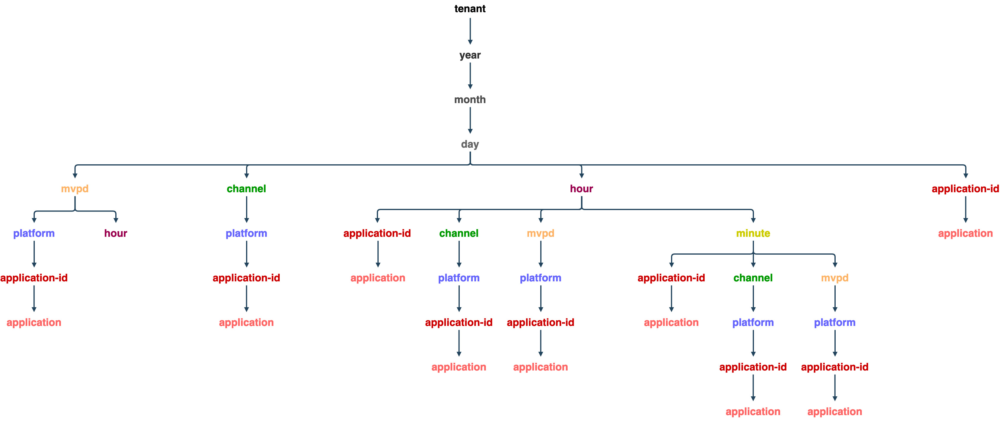

# API d’utilisation de la surveillance de la simultanéité {#cmu-api-usage}

>[!NOTE]
>
>Le contenu de cette page est fourni à titre d’information uniquement. L’utilisation de cette API nécessite une licence actuelle de Adobe. Aucune utilisation non autorisée n’est autorisée.

## Présentation des API {#api-overview}

L’utilisation de la surveillance de la simultanéité (CMU) est mise en oeuvre sous la forme d’un WOLAP (basé sur le Web) [Traitement Analytics en ligne](http://en.wikipedia.org/wiki/Online_analytical_processing)). CMU est une API Web de création de rapports d’entreprise générique, soutenue par un entrepôt de données. Il agit comme un langage de requête HTTP qui permet d’effectuer entièrement des opérations OLAP standard.


>[!NOTE]
>
>L’API CMU n’est pas disponible en général. Contactez votre représentant Adobe pour toute question concernant la disponibilité.

L’API CMU fournit une vue hiérarchique des cubes OLAP sous-jacents. Chaque ressource ([dimension](/help/authentication/entitlement-service-monitoring-overview.md#progr-filter-metrics) dans la hiérarchie de dimension, mappée en tant que segment de chemin d’URL) génère des rapports avec (agrégé). [mesures](/help/authentication/entitlement-service-monitoring-overview.md#programmers-can-monitor-the-following-metrics) pour la sélection en cours. Chaque ressource pointe vers sa ressource parente (pour le cumul) et ses sous-ressources (pour l’analyse). Le découpage et la découpe s’effectuent par le biais de paramètres de chaîne de requête en épinglant des dimensions à des valeurs ou des plages spécifiques.

L’API REST fournit les données disponibles dans un intervalle de temps spécifié dans la requête (revenant aux valeurs par défaut si aucune valeur n’est fournie), en fonction du chemin d’accès à la dimension, des filtres fournis et des mesures sélectionnées. La période ne sera pas appliquée aux rapports qui ne contiennent pas de dimensions temporelles (année, mois, jour, heure, minute, seconde).

Le chemin d’accès racine de l’URL du point de terminaison renvoie les mesures agrégées globales dans un seul enregistrement, ainsi que les liens vers les options d’analyse disponibles. La version de l’API est mappée en tant que segment de fin du chemin d’accès URI du point d’entrée. Par exemple, https://mgmt.auth.adobe.com/cmu/*v2* signifie que les clients auront accès à WOLAP version 2.

Les chemins d’URL disponibles sont détectables via des liens contenus dans la réponse. Les chemins d’URL valides sont conservés pour mapper un chemin d’accès dans l’arborescence déroulante sous-jacente qui contient des mesures agrégées (pré-). Un chemin sous la forme /dimension1/dimension2/dimension3 reflétera une pré-agrégation de ces trois dimensions (l’équivalent d’une clause SQL GROUP BY dimension1, dimension2, dimension3). Si une telle pré-agrégation n’existe pas et que le système ne peut pas la calculer à la volée, l’API renvoie une réponse 404 Not Found.

### Arborescence de défilement {#drill-down-tree}

Les arborescences d’exploration suivantes illustrent les dimensions (ressources) disponibles dans CMU 2.0 :

**Dimensions disponibles pour les clients CM**



A `GET` à la fonction `https://mgmt.auth.adobe.com/cmu/v2` Le point de terminaison de l’API renvoie une représentation contenant :

* Liens vers les chemins d’exploration racine disponibles :

  ```html
  <link rel="drill-down" href="/cmu/v2/dimensionA"/>
  <link rel="drill-down" href="/cmu/v2/dimensionB"/>
  ```

* Résumé (valeurs agrégées) pour toutes les mesures (dans l’intervalle par défaut, puisqu’aucun paramètre de chaîne de requête n’est fourni, voir ci-dessous).

Suivant un chemin d’accès d’exploration (étape par étape) : /dimensionA/year/month/day/dimensionX récupère la réponse suivante :

* Liens vers les options d’analyse &quot;dimensionY&quot; et &quot;dimensionZ&quot;
* Rapport contenant des agrégats quotidiens pour chaque valeur de dimensionX

### **Filtres**

À l’exception des dimensions de date/heure, toute dimension disponible pour la projection actuelle (chemin de dimension) peut être filtrée en utilisant son nom comme paramètre de chaîne de requête.

Les options de filtrage disponibles sont les suivantes :

* **Est égal à** Les filtres sont fournis en définissant le nom de la dimension sur une valeur spécifique dans la chaîne de requête.
* **IN** les filtres peuvent être spécifiés en ajoutant plusieurs fois le même paramètre nom-dimension avec des valeurs différentes : dimension=valeur1&amp;dimension=valeur2
* **Non égal à** Les filtres doivent utiliser le caractère &#39;!&#39; symbole situé après le nom de la dimension, ce qui entraîne l’apparition de &quot;!&quot;=&#39; &quot;operator&quot; : dimension !=value
* **NOT IN** Les filtres requièrent le caractère &quot;!=’ à utiliser plusieurs fois, une fois pour chaque valeur de l’ensemble : dimension !=value1&amp;dimension!=value2&amp;...


Il existe également une utilisation spéciale pour les noms de dimension dans la chaîne de requête : si le nom de dimension est utilisé comme paramètre de chaîne de requête sans valeur, l’API aura pour instruction de renvoyer une projection incluant cette dimension dans le rapport.

Exemple de requêtes CMU :

| URL | Équivalent SQL |
|:---|:---|
| /dimension1/dimension2/dimension3?dimension1=value1 | SELECT * de projection WHERE dimension1 = &#39;value1&#39; GROUP BY dimension1, dimension2, dimension3 |
| /dimension1/dimension2/dimension3?dimension1=valeur1&amp;dimension1=valeur2 | SELECT * de projection WHERE dimension1 DANS (&#39;value1&#39;, &#39;value2&#39;) GROUP BY dimension1, dimension2, dimension3 |
| /dimension1/dimension2/dimension3?dimension1!=value1 | SÉLECTIONNEZ * depuis la projection OÙ dimension1 &lt;> &quot;valeur1&quot; GROUPE PAR dimension1, dimension2, dimension3 |
| /dimension1/dimension2/dimension3?dimension1!=value1&amp;dimension2!=value2 | SÉLECTIONNEZ * depuis la projection OÙ dimension1 NE SE TROUVE PAS DANS (&#39;value1&#39;, &#39;value2&#39;) GROUP PAR dimension1, dimension2, dimension3 |
| En supposant qu’il n’y ait pas de chemin direct : /dimension1/dimension3 mais qu’il y ait un chemin : /dimension1/dimension2/dimension3  </br></br> /dimension1?dimension3 | SELECT * depuis la projection GROUP BY dimension1,dimension3 |

>[!NOTE]
>
>Aucune de ces techniques de filtrage ne fonctionnera pour les dimensions date/heure. Le seul moyen de filtrer les dimensions date/heure consiste à définir les paramètres de chaîne de requête de début et de fin (décrits ci-dessous) sur les valeurs requises.

Les paramètres de chaîne de requête suivants ont une signification réservée pour l’API (ils ne peuvent donc pas être utilisés comme noms de dimension, sinon aucun filtrage ne serait possible pour une telle dimension).

Paramètres de chaîne de requête réservés à l’API CMU :

| Paramètre | Facultatif | Description | Valeur par défaut | Exemple |
|:--------------|:--------|:---------------------------------------------------------------------------------------------------------------------------------------------------------------------------------------------------------------------------------------------------------------------------------------------------|:-------------------------------------------------------------------------------------------------------------------------------|:------------------------------------------|
| access_token | Oui | Si la protection OAuth IMS est activée, le jeton IMS peut être transmis en tant que jeton porteur d’autorisation standard ou en tant que paramètre de chaîne de requête. | Aucun | access_token=XXXX |
| nom-dimension | Oui | Tout nom de dimension, contenu dans le chemin d’URL actuel ou dans un sous-chemin valide ; la valeur sera traitée comme un filtre égal. Si aucune valeur n’est fournie, la dimension spécifiée sera alors incluse dans la sortie même si elle n’est pas incluse ou adjacente au chemin actuel. | Aucun | someDimension=someValue&amp;someOtherDimension |
| end | Oui | Heure de fin du rapport en millisecondes | Heure actuelle du serveur | end=2012-07-30 |
| format | Oui | Utilisé pour la négociation de contenu (avec le même effet mais une priorité inférieure au chemin &quot;extension&quot; - voir ci-dessous). | Aucun : la négociation du contenu tentera les autres stratégies | format=json |
| limit | Oui | Nombre maximal de lignes à renvoyer | Valeur par défaut signalée par le serveur dans le lien self si aucune limite n’est spécifiée dans la requête. | limit=1500 |
| mesures | Oui | Liste de noms de mesures séparés par des virgules à renvoyer. Elle doit être utilisée à la fois pour filtrer un sous-ensemble des mesures disponibles (afin de réduire la taille de la payload) et pour appliquer l’API afin de renvoyer une projection contenant les mesures demandées (plutôt que la projection optimale par défaut). | Toutes les mesures disponibles pour la projection actuelle seront renvoyées si ce paramètre n’est pas fourni. | metrics=m1,m2 |
| start | Oui | Heure de début du rapport ISO8601 ; le serveur remplira la partie restante si seul un préfixe est fourni : par exemple, start=2012 donnera start=2012-01-01:00:00:00 | Signalé par le serveur dans le lien self : le serveur tente de fournir des valeurs par défaut raisonnables en fonction de la granularité temporelle sélectionnée. | start=2012-07-15 |


La seule méthode HTTP actuellement disponible est GET. La prise en charge des OPTIONS/méthodes HEAD peut être fournie dans les versions ultérieures.


## Codes d’état de l’API CMU {#cmu-api-status-codes}

| Code d’état | Expression de motif | Description |
|:-----------|:---------------------|:------------------------------------------------------------------------------------------------------------------------------------------------------------------------------------------------------------------------------------------------------------------------------------------------------------------------------------------------------------------------------------------------------------------------------------------------------------------------------------------------------------|
| 200 | OK | La réponse contiendra les liens &quot;Cumul&quot; et &quot;Exploration&quot; (le cas échéant). Le rapport sera rendu en tant qu’attribut de la ressource : élément/propriété &quot;rapport&quot; imbriqué. |
| 400 | Requête incorrecte | Le corps de la réponse contient un message texte expliquant ce qui ne va pas avec la requête.  Un état de requête incorrecte 400 est accompagné d’un texte explicatif dans le corps de la réponse (type de média brut/texte) qui fournit des informations utiles concernant l’erreur client. Outre les scénarios triviaux tels que les formats de date non valides ou les filtres appliqués aux dimensions non existantes, le système refusera également de répondre aux requêtes qui nécessitent un volume massif de données à renvoyer ou à agréger à la volée. |
| 401 | Non autorisé | En raison d’une requête qui ne contient pas les en-têtes OAuth appropriés pour authentifier l’utilisateur |
| 403 | Interdit | Indique que la demande n’est pas autorisée dans le contexte de sécurité actuel ; cela se produit lorsque l’utilisateur est authentifié, mais pas autorisé à accéder aux informations demandées. |
| 404 | Introuvable | Se produit lorsqu’un chemin d’URL non valide est fourni avec la requête. Cela ne devrait jamais se produire si le client suit les liens &quot;zoom descendant&quot;/&quot;cumul&quot; fournis avec 200 réponses. |
| 405 | Méthode non autorisée | Indique qu’une méthode non prise en charge a été utilisée dans la requête. Bien que, pour l’heure, seule la méthode GET soit prise en charge, les futures versions pourront autoriser les HEAD ou les OPTIONS. |
| 406 | Non accepté | Indique qu’un type de média non pris en charge a été demandé par le client. |
| 500 | Erreur interne du serveur | &quot;Ça ne devrait jamais arriver&quot; |
| 503 | Service indisponible | Indique une erreur dans l’application ou ses dépendances. |

## Formats de données {#data-formats}

Les données sont disponibles dans les formats suivants :

* JSON (par défaut)
* XML
* CSV
* HTML (à des fins de démonstration)


Les stratégies de négociation de contenu suivantes peuvent être utilisées par les clients (la priorité est donnée par le poste dans la liste - premier élément) :

1. Une &quot;extension de fichier&quot; ajoutée au dernier segment du chemin d’URL : par exemple, /cmu/v2/tenant/year/month/day.xml. Si l’URL contient une chaîne de requête, l’extension doit précéder le point d’interrogation : `/cmu/v2/tenant/year/month/day.csv?mvpd=SomeMVPD`
1. Un paramètre de chaîne de requête de format : par exemple, `/cmu/report?format=json`
1. En-tête HTTP Accept standard : par exemple, `Accept: application/xml`

&quot;extension&quot; et le paramètre de requête prennent en charge les valeurs suivantes :

* xml
* json
* csv
* html

Si aucun type de média n’est spécifié par l’une des stratégies, l’API génère du contenu JSON par défaut.

## Langage d’application hypertexte (HAL) {#hypertext-app-lang}

Pour JSON et XML, la charge utile sera codée en tant que HAL, comme décrit ici : `http://stateless.co/hal_specification.html`.

Le rapport réel (une balise/propriété imbriquée appelée &quot;rapport&quot;) se compose de la liste réelle d’enregistrements contenant toutes les dimensions et mesures sélectionnées/applicables avec leurs valeurs, codées comme suit :

### JSON {#json}

```js
 "report": [
  {
    "dimension1": "d1",
    ...
    "metric1": "m1",
    ...
  }, {
    ...
  }
]
```

### XML {#xml}

```xml
 <report>
  <record dimension1="d1" ... metric1="m1" ... />
  ...
</report>
```

Pour les formats XML et JSON, l’ordre des champs (dimensions et mesures) dans un enregistrement n’est pas spécifié, mais cohérent (l’ordre sera le même dans tous les enregistrements). Toutefois, les clients ne doivent pas se fier à un ordre particulier des champs dans un enregistrement.

Le lien de la ressource (le rel &quot;self&quot; dans JSON et l’attribut de ressource &quot;href&quot; dans XML) contient le chemin actuel et la chaîne de requête utilisée pour le rapport intégré. La chaîne de requête affiche tous les paramètres implicites et explicites, de sorte que la charge utile indique explicitement l’intervalle de temps utilisé, les filtres implicites (le cas échéant), etc. Le reste des liens de la ressource contiendra tous les segments disponibles qui peuvent être suivis afin d’analyser en détail les données actives. Un lien de cumul est également fourni, qui pointe vers le chemin parent (le cas échéant). La variable `href` pour les liens d’analyse/de cumul contiennent uniquement le chemin d’URL (il n’inclut pas la chaîne de requête ; le client doit donc l’ajouter si nécessaire). Notez que tous les paramètres de chaîne de requête utilisés (ou implicites) par la ressource actuelle ne s’appliqueront pas aux liens &quot;de cumul&quot; ou &quot;d’exploration&quot; (par exemple, les filtres peuvent ne pas s’appliquer aux sous-ressources ou aux super-ressources).

Exemple (en supposant qu’il existe une mesure unique appelée clients et qu’il existe une pré-agrégation pour `year/month/day/...`) :

* `https://mgmt.auth.adobe.com/cmu/v2/year/month.xml`

  ```xml
  <resource href="/cmu/v2/year/month?start=2012-07-20T00:00:00&end=2012-08-20T14:35:21">
    <links>
      <link rel="roll-up" href="/cmu/v2/year"/>
      <link rel="drill-down" href="/cmu/v2/year/month/day"/>
    </links>
    <report>
      <record month="6" year="2012" clients="205"/>
      <record month="7" year="2012" clients="466"/>
    </report>
  </resource>
  ```

* `https://mgmt.auth.adobe.com/cmu/v2/year/month.json`

  ```js
  {
    "_links" : {
      "self" : {
        "href" : "/cmu/v2/year/month?start=2012-07-20T00:00:00&end=2012-08-20T14:35:21"
      },
      "roll-up" : {
        "href" : "/cmu/v2/year"
      },
      "drill-down" : {
        "href" : "/cmu/v2/year/month/day"
      }
    },
    "report" : [ {
      "month" : "6",
      "year" : "2012",
      "clients" : "205"
    }, {
      "month" : "7",
      "year" : "2012",
      "clients" : "466"
    } ]
  }
  ```

### CSV {#csv}

Dans le format de données CSV, aucun lien ou autre métadonnées (à l’exception de la ligne d’en-tête) ne sera fourni en ligne ; les métadonnées de sélection seront fournies dans le nom de fichier, selon le modèle suivant :

```html
report__<start-date>_<end-date>_<filter-values,...>.csv
```

Le fichier CSV contient une ligne d’en-tête, puis les données du rapport sous forme de lignes suivantes. La ligne d’en-tête contient toutes les dimensions suivies de toutes les mesures. L’ordre de tri des données du rapport est reflété dans l’ordre des dimensions. Par conséquent, si les données sont triées par D1 puis par D2, l’en-tête CSV se présente comme suit : `D1, D2, ...metrics....`

L’ordre des champs dans la ligne d’en-tête reflète l’ordre de tri des données du tableau.

Exemple : https://mgmt.auth.adobe.com/cmu/v2/year/month.csv produira un fichier nommé ```report__2012-07-20_2012-08-20_1000.csv``` avec le contenu suivant :

| Année | Mois | Clients |
|:----:|:-----:|:-------:|
| 2012 | 6 | 580 |
| 2012 | 7 | 231 |

## Actualisation des données {#data-freshness}

Bien que la requête contienne un en-tête Last-Modified, elle **NE FAIT PAS** reflètent l’heure de la dernière mise à jour du rapport dans le corps. Les rapports généraux sont calculés régulièrement, avec les règles suivantes :

* si la granularité temporelle est **year** ou **month**, le rapport est mis à jour tous les 2 jours.
* si la granularité temporelle est **day**, le rapport est mis à jour toutes les 3 heures.
* si la granularité temporelle est **hour**, le rapport est mis à jour toutes les heures.
* si la granularité temporelle est **minute**, le rapport est mis à jour toutes les minutes.

La variable **niveau d&#39;activité** et **niveau de simultanéité** les rapports sont mis à jour chaque jour, quelle que soit la granularité temporelle.

## Compression GZIP {#gzip-compression}

Adobe recommande vivement d’activer la prise en charge de gzip dans les clients qui récupèrent des rapports CMU. Cela réduira considérablement la taille de la réponse, ce qui réduit votre temps de réponse. (Le taux de compression des données en CMU se situe entre 20 et 30.)

Pour activer la compression gzip dans votre client, définissez l’en-tête Accept-Encoding: comme suit :

```
Accept-Encoding: gzip, deflate
```

## Informations connexes {#related-information}

* [Présentation de CMU](/help/concurrency-monitoring/cm-usage-reports.md)
