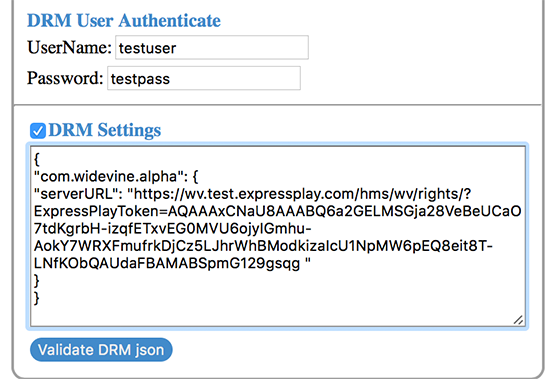

# Lecture du contenu protégé {#playback-your-protected-content}

Pour tester votre solution DRM, vous avez besoin d’une application vidéo capable de traiter la solution DRM que vous utilisez. Ce lecteur peut être un exemple de lecteur rendu disponible par Adobe, ou votre propre application vidéo basée sur TVSDK.

1. Utilisez l’URL du serveur de licences à partir de la réponse du jeton que vous avez reçue du serveur ExpressPlay pour vérifier si vous pouvez lire votre contenu protégé.

   * **Widevine** - Utilisez la réponse Widevine directement à la réception de votre demande de jeton de licence ExpressPlay.
   * **PlayReady** - Obtenez l’URL et le jeton du serveur de licences à partir de l’objet JSON renvoyé par votre demande de jeton de licence.
   * **FairPlay** - Utilisez la réponse de FairPlay directement reçue de votre demande de jeton de licence ExpressPlay.

1. Testez la lecture de votre contenu protégé en utilisant votre propre lecteur ou un exemple de lecteur Adobe existant.

   Indiquez l’URL de votre contenu protégé (l’emplacement de votre manifeste M3U8 ou MPD, selon la solution DRM que vous testez).

   Selon l’interface fournie par le lecteur avec lequel vous effectuez le test, vous pouvez être invité à fournir l’URL de licence et un jeton distincts sous forme de chaînes dans les champs de saisie, d’objet JSON collé dans une zone de texte ou peut-être sous forme de paramètre de  dans l’URL.

   Voici quelques possibilités pour les lecteurs de test :

   * Lecteur de référence HTML5 :

      ```
      https://ptdemos.com/html5/internal/1_2/2.4_GM/samples/reference/reference_player.html
      ```

   * Shaka Player :

      ```
      https://shaka-player-demo.appspot.com
      ```

   * Exemple de lecteur TVSDK (en cours de développement) -

   ```
   https://drmtest2.adobe.com/TVSDK_HTML5/samples/reference/reference_player.html
   ```

   **Vérification de la lecture lors du test de votre configuration FairPlay :** FairPlay nécessite quelques étapes supplémentaires pour lire le contenu lorsque vous utilisez les serveurs de licences ExpressPlay. Si vous utilisez [!DNL curl] pour tester vos connexions (comme décrit dans la section [Licence](../../multi-drm-workflows/quick-start/handle-the-licensing.md)), vous devez *modifier votre manifeste* M3U8 (votre contenu compressé) comme suit :

1. Ajouter la réponse que vous avez reçue de votre demande de jeton de licence à la `#EXT-X-KEY:` balise dans le manifeste ; et
1. Modifiez le protocole de cette URL de la réponse (maintenant dans le manifeste), de `https://` à `skd://`.

   Voici un exemple complet pour tester la lecture avec FairPlay, y compris l’étape de licence :

1. Utilisez la demande de jeton de licence FairPlay pour obtenir l’URL de votre jeton de licence. (Utilisez votre propre Authentificateur du client Production, et veillez à utiliser le même CEK et `iv` celui qui a été utilisé pour assembler votre contenu FairPlay.) Exécutez la commande suivante pour obtenir l’URL du jeton de licence pour l’exemple de contenu :

   ```
   curl -v "https://fp-gen.service.expressplay.com/hms/fp/token? 
   customerAuthenticator=[YOUR-PRODUCTION-AUTHENTICATOR]&errorFormat=json 
   &contentKey CEK as query parameter contentKey 
   =[YOUR CONTENT KEY]&iv=[YOUR IV]"
   ```

   Vous devez obtenir une réponse avec l’URL du jeton de licence qui ressemble à quelque chose comme ceci :

   ```
   https://fp.service.expressplay.com:80/hms/fp/rights/? 
   ExpressPlayToken=AQAAABNlKcEAAABQaTjshua3cWjG_Il3fvhf3g-CR1rn 
   JKdtaVaAnhkfTCW0bWAU76YgwForbrXhD5tXUHhfP7FD1svvLPxN5qomYsnwY 
   SSwcDq1ZnRtXunFLueTw6LAL52aZllMLasCSzYRMaAVHw 
   ```

1. Placez la réponse URL du jeton de licence renvoyé dans votre manifeste M3U8, puis *modifiez le modèle d’URL du jeton de licence en* remplaçant `sdk://` `https://`par &quot;from&quot;. Voici un exemple de la balise #EXT-X-KEY dans votre manifeste M3U8 :

   ```
   #EXT-X-KEY:METHOD=SAMPLE-AES, 
   URI="skd://fp.service.expressplay.com:80/hms/fp/rights/? 
   ExpressPlayToken=AQAAABNlKcEAAABQaTjshua3cWjG_Il3fvhf3g- 
   CR1rnJKdtaVaAnhkfTCW0bWAU76YgwForbrXhD5tXUHhfP7FD1svvLPx 
   N5qomYsnwYSSwcDq1ZnRtXunFLueTw6LAL52aZllMLasCSzYRMaAVHw", 
   KEYFORMAT="com.apple.streamingkeydelivery",KEYFORMATVERSIONS="1"
   ```

   >[!NOTE] {importance=&quot;high&quot;}
   >
   >Les informations ci-dessus s&#39;appliquent uniquement aux tests de votre configuration FairPlay. Il peut ne pas s’appliquer à votre configuration de production, selon la configuration de votre gestionnaire FairPlay. Voir [Activer Apple FairPlay dans les applications](../../../programming/tvsdk-3x-ios-prog/ios-3x-drm-content-security/ios-3x-apple-fairplay-tvsdk.md) iOS pour en savoir plus.

Si votre vidéo est lue, vous avez assemblé et mis sous licence votre contenu. Si votre vidéo ne se lit pas, consultez la page de dépannage pour trouver d’éventuelles solutions à vos problèmes.

<!--<a id="example_603D92A1F3924467B5D66EC862B8F59C"></a>-->

Par exemple, voici la partie de l’interface utilisateur dans le premier lecteur de test répertorié ci-dessus, où vous fournissez les informations de licence obtenues auprès du serveur ExpressPlay :

<!--<a id="fig_zjy_q2c_rw"></a>-->


