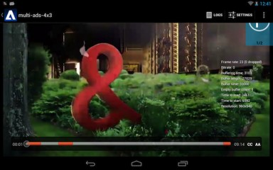

# Contrôler la chronologie de la lecture{#inspect-the-playback-timeline}

Vous pouvez obtenir une description de la chronologie associée à l’élément actuellement sélectionné lu par TVSDK. Cela s’avère particulièrement utile lorsque votre application affiche un contrôle de barre de défilement personnalisée dans lequel les sections de contenu correspondant au contenu publicitaire sont identifiées.

Voici un exemple d’implémentation, comme illustré dans la capture d’écran suivante.  {width=&quot;368.641pt&quot;}

1. Accédez à l&#39; `Timeline` objet dans la `MediaPlayer` méthode à l&#39;aide de la `getTimeline` méthode.

   La `Timeline` classe encapsule les informations liées au contenu de la chronologie associée à l&#39;élément média actuellement chargé par l&#39; `MediaPlayer` instance. La `Timeline` classe permet d&#39;accéder à une vue en lecture seule de la chronologie sous-jacente. La `Timeline` classe fournit une méthode getter qui fournit un itérateur à travers une liste d&#39; `TimelineMarker` objets.

1. Effectuez une itération sur la liste des `TimelineMarkers` informations renvoyées et utilisez-les pour mettre en oeuvre votre chronologie.

       Un objet &quot;TimelineMarker&quot; contient deux informations :
   
   * Position du marqueur sur la chronologie (en millisecondes)
   * Durée du marqueur sur la chronologie (en millisecondes)

1. Implémentez l’interface de rappel du processus d’écoute `MediaPlayer.PlaybackEventListener.onTimelineUpdated` et enregistrez-la avec l’ `Timeline` objet.

   L’ `Timeline` objet peut informer votre application des modifications qui peuvent se produire dans le journal de lecture en appelant votre `OnTimelineUpdated` écouteur.

```java
// access the timeline object 
Timeline timeline = mediaPlayer.getTimeline(); 
// iterate through the list of TimelineMarkers 
Iterator<TimelineMarker> iterator = timeline.timelineMarkers(); 
while (iterator.hasNext()) { 
   TimelineMarker marker = iterator.next(); 
   // the start position of the marker 
   long startPos = marker.getTime(); 
   // the duration of the marker 
   long duration = marker.getDuration(); 
}
```

